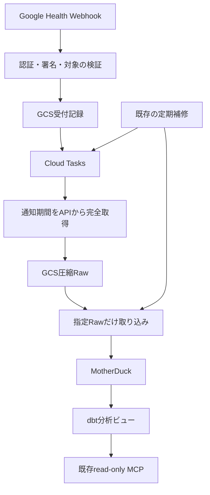

# Fitbit連携計画

更新日: 2026-09-27

## 実装範囲

アプリにはWebhookを使った継続取り込みと、その経路の復旧・分析を実装する。
過去データのZIP取り込みは一度限りの別作業とし、パーサー・取り込みCLI・照合ファイル管理・
ファイル取り込み台帳をアプリに残さない。本番運用はまだ有効化しない。

- source / streamは`fitbit / health`。Google Health APIの`google-wearables`を使う。
- 対象は歩数、心拍、日次安静時心拍、アクティブゾーン時間、睡眠とその段階・短い覚醒。
- Macの常時稼働を必要としない。PDP専用Cloud Run Service 1つとCloud Tasks queue 1つを追加する。
- Serviceはmin instance 0、queue同時実行は1。共有Loader leaseでScreen Timeとの書き込みを調整する。
- 旧health-data-pipelineのJob・queue・Schedulerを再開せず、Notion・SVG・全履歴コピーを持ち込まない。

確定した仕様の正本は[Fitbit source docs](../sources/fitbit/README.md)に置く。

## 継続取り込みの要件

1. Webhookの共有Authorization、Tink署名、対象owner、対象5種類を検証する。購読の検証要求にも応答する。
2. 受付記録の永続化とCloud Tasks登録を済ませて204を返す。キュー登録失敗時にも記録を残して復旧できるようにする。
3. 内部workerではOIDCの署名・issuer・audience・SA email・email_verifiedを検証する。公開Serviceであることに認証を依存させない。
4. 通知期間を種別に合った日時cursorで全ページ取得する。取得失敗を空結果として扱わず、完全な空結果だけを削除として反映する。
5. Rawのkeyとgenerationを受付に記録し、そのオブジェクトだけをLoaderで取り込む。通知ごとの全件一覧取得・migration・dbt runを避ける。
6. 内容が変わらない再取得は分析行の再書き込みを省く。A→B→A、順序逆転、期間重複、睡眠IDの日付移動と削除を正しく処理する。
7. DB commit結果不明時には接続を破棄し、再接続して台帳を確認する。受付更新前に停止しても確定済みRawを再利用できるようにする。

追加migrationで7つのbase table、取得範囲台帳、削除済みIDの順位台帳を導入する。
UTC時刻・元のoffset・提供元日付を保存し、睡眠段階と短い覚醒を二重加算しない。AZMへ重みを二重適用しない。

分析は日次健康指標、歩数・心拍の時系列、睡眠、睡眠開始前2時間のScreen TimeをViewで提供する。
日付比較はAsia/Tokyo。Screen Timeは端末別に保持し、MacとiPhoneの同時使用を単純合算しない。

## 補修・保存・費用

- API Rawと受付記録は30日で削除対象とする。Raw削除の監査猶予は3日。Screen Timeの90日保持は変更しない。
- 既存reconciliationに未完了受付・未取込Rawの回復と、1日1回の直近7日照合を接続する。Schedulerは増やさない。
- 長期停止・7日より前の修正は`pdp fitbit sync --from ... --to ...`で補完する。
- 端末から通知がない状態と、受付済み処理が詰まっている状態を区別する。未完了受付が27日以上なら異常として扱う。
- 正常時の目標はWebhook受付から5分以内の分析反映。端末からGoogleへの同期時間を含めない。実測は未完了。
- 本番開始前にGCS操作・Raw増加量・MotherDuck実CUを測り、既存処理込みの月間見込みが無料枠に20%の余裕を残すことを確認する。
- Liteで利用できる使用量/請求画面を使う。ローカル処理時間・SQL数やBusiness専用QUERY_HISTORYを実CU計測の代わりにしない。
- 費用停止ではAPI/DB処理を止めて通知を保持する。予算通知を厳密な課金上限とみなさず、保持期限前に復旧を判断する。

## 過去分の一度限りの投入

本番への初回移行時に、Codexが一時スクリプトでTakeout ZIPを検証し、MotherDuckへ一度だけ投入する。
このスクリプトはアプリの機能・依存・CLIとして配布しない。今回の実装にはスクリプト作成や実投入を含めない。
ZIP由来の健康データ・認証情報・一時スクリプトをGitに追加しない。

一度限りの投入では、次を確認する。

- 元ZIPのhashと処理件数・期間を記録し、元入力と照合結果を手元で保管する。
- 新CSVだけを使い、旧JSONを混ぜず、スマートフォン由来の歩数を除外する。
- 睡眠はAPI reconcileが選択したIDで旧/新アルゴリズムの重複を解消する。v2優先だけで代替しない。
- 同日の安静時心拍の矛盾はAPI照合で確定し、未解決の値は投入しない。
- 部分失敗からの再開と重複防止は一時スクリプト内で管理する。GCS台帳へ架空のオブジェクトを作らない。
- API確定済み期間を古いZIPで上書きしない。継続取り込みとの境界を重ねて照合する。

調査対象は`/Users/binbi/Downloads/takeout-20260926T121107Z-1-001.zip`、
SHA-256は`ea328ec61e714766208e1cfea368c010c25d28fca48668f9d49676ef8be1f303`。
調査記録では心拍9,029,170行、歩数49,564行（端末由来47,294行）、安静時心拍254行/252日、
AZM 2,271行、睡眠611 ID。安静時心拍は2日分に矛盾がある。
過去のAPI照合では有効な睡眠341 IDがZIPと一致した（v2 259件、v1 82件）。投入時には改めて照合する。
ローカルDBサイズはMotherDuck実ストレージや課金量の証明として扱わない。

## 実装状況と残る導入作業

Webhook・API・Raw・Loader・復旧・分析・既定で無効のTerraform構成をローカル実装済み。
Ruff・strict mypy・pytest 505件、Terraform fmt/validate/mock test 11件、wheelビルドを確認した。
Docker Engineが起動していないためコンテナ実行は未確認。これらをクラウド動作・実CUの検証と分けて扱う。

本番開始までに残る作業:

1. 本番と別のバケット・DB・SAで通常頻度と集中到着を再現し、遅延・費用・再試行・監視を検証する。
2. 購読管理APIのCPEロール・実行主体・quota projectを確認する。事前調査の一覧取得は403だった。
3. スキーマとView、Secret Manager参照、IAM、OIDC、署名、実際の保持設定を適用・検証する。
4. 一時スクリプトで過去分を投入し、購読開始までの区間をAPIで補完する。
5. 対象5種類だけのPDP専用`pdp-fitbit`購読を登録し、実端末同期から分析まで到達することを確認する。

想定環境はproject `health-data-pipeline-503813`、region `us-central1`、
Raw bucket `health-data-pipeline-503813-pdp-raw`。旧リソースとの二重管理を避ける。
具体的な手順と本番未検証事項は[運用文書](../sources/fitbit/operations.md)にまとめる。
