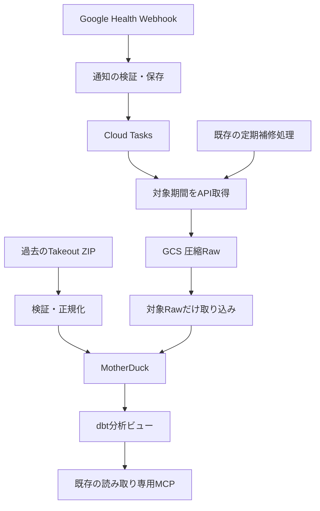

# Fitbitデータソース追加計画

作成日: 2026-09-27

本書は実装期間中の一時的な設計・引き継ぎ文書である。実装と検証が完了したら、確定した仕様・操作手順・制約を `docs/sources/fitbit/` および関連する既存のプラットフォーム文書へ移し、**本書を削除する**。本番未確認事項が残る場合は、削除前に運用文書へ明記する。

## 1. 採用する構成

過去分はTakeout ZIPからMotherDuckへ直接取り込み、今後はWebhookで通知された期間を取得して即時反映する。定期処理は障害復旧・取りこぼしの補修に使う。

- データソース名は `fitbit`。取得にはGoogle Health APIを使う。
- 初期対象は歩数、心拍、日次安静時心拍、睡眠と睡眠段階、アクティブゾーン時間。HRV・SpO2・運動記録などは対象外。
- APIは `google-wearables` を指定する。過去データもFitbit端末由来にそろえ、スマートフォンだけで計測した歩数を除外する。
- Macの常時稼働は不要。既存のOAuth認証情報を利用し、PDP側に受信・処理機能を追加する。
- 旧health-data-pipelineの停止中のジョブ・キューは再開しない。Notion・SVG出力や全履歴スナップショットの処理を持ち込まない。

## 2. 過去データの取り込み

### 入力と再実行

- 入力ZIP: `/Users/binbi/Downloads/takeout-20260926T121107Z-1-001.zip`
- SHA-256: `ea328ec61e714766208e1cfea368c010c25d28fca48668f9d49676ef8be1f303`
- ZIP内の新しいCSV形式を採用する。同じ情報の旧JSON形式は混ぜず、無関係なプロフィール・セキュリティ情報は読み込まない。
- ZIPのハッシュ、パーサーバージョン、処理済み区間をファイル取り込み専用の台帳に記録する。GCS用の取り込み台帳に架空のオブジェクトを登録しない。
- 日付単位で処理・確定し、中断後は未完了区間から再開する。同じZIPの再実行でデータを増殖させない。
- 元ZIPと取り込み時の照合結果を手元に保管し、再構築の入力にする。過去分のGCS保存は不要。元ZIP・健康データ・認証情報はGitに追加しない。

### 重複・矛盾の解消

- 睡眠はAPIの `reconcile` が選択した有効な睡眠IDに対応するCSVを取り込む。旧・新アルゴリズムの重複記録を合算しない。
- 安静時心拍は、同じ日付に異なる値がある2日分をAPIで確定する。
- 照合結果には取得日時とハッシュを付けて保存する。解決できない記録は理由付きで保留し、恣意的に値を選ばない。
- ZIPを後から再投入しても、APIで更新済みの期間を古い値に戻さない。

### 調査時点の入力確認結果

- ZIPは95,173,126 bytes、展開後約1.41 GB、4,098ファイル。CRC検証済み。
- 心拍CSVは252日・9,029,170行。歩数CSVは49,564行で、端末由来は47,294行。
- 安静時心拍は254行・252日。アクティブゾーン時間は2,271行・190日。
- 睡眠CSVは611 ID。旧・新アルゴリズムに重複がある。読み取り専用のAPI照合では有効な341件すべてがZIP内IDに一致した。内訳はv2が259件、v1が82件であり、単純なv2優先では代替できない。
- 睡眠にはUTCオフセット+08/+09がある。短い覚醒は睡眠段階と重複し得る。
- ローカルDuckDBでの概算サイズはMotherDuckの実ストレージ量・課金量を証明しない。

## 3. Webhookによる継続取り込み

### 受信と処理

PDP専用のCloud Run Serviceを1つ、Cloud Tasksキューを1つ追加する。Serviceは最小インスタンス数0とし、通知ごとのCloud Run Job起動を避ける。

1. 公開受信口で認証・署名・対象ユーザー・データ種別を検証する。購読登録時の検証要求にも対応する。
2. 通知を小さなGCS受付記録として保存し、Cloud Tasksへ登録する。
3. 登録成功後に204を返す。
4. ワーカーが対象期間を取得し、圧縮Rawを保存する。
5. そのRawだけMotherDuckに反映して完了を記録する。

受付記録はキュー登録失敗・再試行終了時の復旧に使う。全通知履歴を毎回コピーする方式にはしない。Cloud Tasksにネイティブのデッドレターキューがあるとは想定しない。

ワーカー入口はCloud Tasks用サービスアカウントのOIDCトークンを検証する。公開Webhookと同じService内に置くため、Service全体の公開設定だけに内部入口の保護を依存させない。Secret Manager参照と実行サービスアカウントの最小権限を使用し、秘密値をTerraform state・ログ・イメージへ埋め込まない。

### 対象期間の更新

- 通知を受けたら実行可能になり次第処理する。毎時まで待つ設計や意図的な時間待ちによるバッチ化はしない。
- 一つの通知に含まれる同種の重複期間はまとめる。
- APIは変更された行そのものを返すとは限らないため、通知期間を再取得して、その範囲の現在値を置き換える。
- 種別ごとの日時フィルターに合わせて取得範囲を補正する。全ページ取得が成功した範囲だけを更新し、取得していない範囲を削除しない。
- APIのフィルターは同じフィールドに対する `>=` と `<` を使う。区間データの開始時刻、サンプル時刻、日次日付、睡眠終了時刻を混同しない。区間境界は既存データとの重なりを含めて補正する。
- 完全な取得結果が空なら削除として反映する。取得失敗・途中ページ欠落を空データとして扱わない。
- 通常データの最大ページサイズ10,000件、睡眠25件を考慮し、必ずページトークンを走査する。

### 重複・競合・障害

- キューの同時実行数は1。MotherDuckへの書き込みはScreen Timeと同じ共有ロックを使い、競合時は再試行する。受信処理はワーカー実行中も応答できるようにする。
- 重複通知は現在の内容と比較して不要な書き込みを省く。ただし「A→B→A」の変更は正しく反映する。過去に見たハッシュという理由だけで永続的に除外しない。
- 古い再試行が新しい取得結果を上書きしないよう、取得順序と反映済み範囲を管理する。
- 認証切れ、API制限、GCS障害、DB確定結果不明を区別する。確定結果不明では接続を破棄し、台帳を確認してから再試行する。
- 正常時の目標はWebhook受付から5分以内の分析反映。端末からGoogleへの同期時間は含めない。

## 4. 保存・分析・運用

### 既存基盤への追加

- 既存のSourceAdapterに `fitbit/health` を追加し、5種類を扱う共通Raw形式を定義する。取得範囲、全ページ取得完了、取得順序、スキーマバージョンを保持する。
- 既存Loaderに、指定したRawオブジェクトとgenerationだけを読む入口を追加する。通知ごとの全件一覧取得・マイグレーション実行を避ける。
- テーブルは歩数区間、心拍サンプル、日次安静時心拍、アクティブゾーン区間、睡眠セッション、睡眠段階、短い覚醒に分ける。
- UTC時刻、元の時差、提供元の日付、取得元を保存する。APIにIDがないサンプルはユーザー・種別・時刻または区間のキーで扱う。
- 欠測を0に置き換えず、短い覚醒と睡眠段階の時間を二重加算しない。アクティブゾーン時間の強度による重みを二重適用しない。
- 共通基盤がトランザクションと台帳を所有し、アダプター側ではcommitしない。スキーマは追加マイグレーションで導入し、適用済みファイルは編集しない。

操作入口:

| コマンド | 用途 |
| --- | --- |
| `pdp fitbit import-takeout <ZIP> --dry-run` | 件数・対象期間・保留項目の確認。通常実行で取り込み |
| `pdp fitbit sync --from ... --to ...` | 指定期間の再取得・修復 |
| `pdp fitbit serve` | Webhook受信とタスク処理 |
| 既存の監査・再構築コマンド | Fitbitの追加、ファイルとRawからの再構築 |

### 分析

dbtビューとして日次の健康指標、心拍・歩数の時系列、睡眠セッション、睡眠開始前2時間のScreen Timeを提供する。

日次比較はAsia/Tokyoを基準とする。Screen TimeはMac・スマートフォン別に保持し、同時使用を単純合算しない。ビューなので取り込みごとの `dbt run` は不要。既存の読み取り専用MCPから分析できるようにする。

### 保存期間と補修

- API Rawと通知受付記録は30日保持し、削除猶予を3日設ける。MotherDuckの分析データは継続保持する。Screen Timeの保持期間は変更しない。
- 既存の定期補修処理を拡張し、未完了通知・未取り込みRawを回復する。ソースごとの保持・パス設定を扱えるようにする。
- 1日1回、直近7日分をAPIと照合する。長期停止やそれ以前の修正は指定期間の手動同期で回復する。補修専用Schedulerを増設せず既存の起動を利用する。
- Raw保持期間外を再構築する場合は、保管ZIPとAPI再取得を使う。元入力もAPIアクセスも失われた場合に完全再構築できるとは保証しない。
- 監視は端末データが来ていない状態と、受信済みデータの処理が詰まった状態を区別する。受付記録の保持期限前に未完了処理を検知する。

### 費用

旧環境の正常稼働4日間では平均約261通知/日だった。ただし旧購読全体の値であり、今回の5種類の通知数ではない。

ストレージ以外にも実行・API操作・DB処理の費用がある。通知ごとの全履歴処理を避け、対象期間だけの取得・更新と小さな受付記録に限定する。GCS受付記録と完了状態の更新も操作料金の見積もりに含める。

MotherDuckの実CU消費は未測定である。本番有効化前に既存処理も含む月間見込みを測り、無料枠に20%の余裕を残せることを運用開始の基準とする。超過見込み時は処理を停止して通知を保持する運用とし、予算通知を厳密な課金上限として扱わない。停止が保持期間を超えそうな場合は復旧または対象期間の再取得を要する。

Liteで利用可能な使用量・請求画面に基づいて測定する。Business専用のQUERY_HISTORYを前提にせず、ローカル処理時間やクエリ数を実CU消費の代用にしない。計測後に無料枠に収まらなければ、即時反映要件を黙って毎時処理に変更せず、実測値を示して運用条件を再決定する。

## 5. 検証と導入順序

1. データモデルとZIP取り込みを実装する。件数・期間・端末除外、睡眠ID選択、安静時心拍の矛盾解消、再投入・中断再開を検証する。
2. API取得と対象範囲の更新を実装する。ページ分割、空結果、削除、日付境界、時差変更、重複・順序逆転・A→B→A・途中失敗を検証する。
3. Webhookと復旧を実装する。署名不正、キュー登録失敗、ロック競合、認証切れ、DB確定結果不明を検証する。既存Screen Timeの取り込み・分析が変わらないことを確認する。
4. 本番とは別のバケット・DB・サービスアカウントを使う隔離環境で通常頻度と集中到着を再現し、反映時間、GCS操作数、Raw増加量、MotherDuck使用量を測る。
5. 本番導入時に購読管理APIの権限を解決し、PDP専用購読を登録する。ZIPの過去分と購読開始までの期間を取り込み、切り替え区間を重ねて照合する。
6. 実際の端末同期から分析ビューまで到達することを確認する。確定仕様と運用手順を恒久ドキュメントへ移し、本書を削除する。

PythonはRuff・strict mypy・関連pytest、Terraformは既存の検証手順を実行する。ローカルテスト合格、クラウド適用、実購読登録、実データ到達は別々の検証結果として扱う。

### 引き継ぎ時点の状態と本番導入の前提

- この計画の機能は未実装。実データの読み取り調査は済んでいるが、新しい経路の本番動作やCU消費は未検証。
- 旧環境は `/Users/binbi/Developer/health-data-pipeline`。Google Health APIへのOAuthリフレッシュとデータ取得は成功した。認証・取得コードは参考にできるが、別リポジトリへの実行時依存は作らない。
- 既存GCPプロジェクトは `health-data-pipeline-503813`、リージョンは `us-central1`。PDP Rawバケットは `health-data-pipeline-503813-pdp-raw`。
- 旧 `health-data-pipeline-dispatch` キューと `health-data-pipeline-hourly` Schedulerは停止中。旧Webhook入口は401を返していた。新しいTerraformと旧リソースの二重管理を避ける。
- 購読管理APIの一覧取得は403だった。登録前にCPEロール・実行主体・quota project設定を確認し、必要最小限の権限で解決する。
- 購読はPDP専用の `pdp-fitbit` とし、対象5種類に限定する。購読開始前のデータは通知されないため、切り替え時のAPI補完が必要。
- クラウド適用、購読登録、本番取り込み、旧構成の変更は、ローカル実装・検証とは分けて実施する。

## 参考仕様

- [Google Health Webhook](https://developers.google.com/health/webhooks)
- [Google Health reconcile API](https://developers.google.com/health/reference/rest/v4/users.dataTypes.dataPoints/reconcile)
- [日時フィルター](https://developers.google.com/health/filters)
- [データの統合方針](https://developers.google.com/health/data-management)
- [睡眠データ](https://developers.google.com/health/data-types/sleep)
- [MotherDuck料金](https://motherduck.com/docs/about-motherduck/billing/pricing/)
- [MotherDuck使用量の確認](https://motherduck.com/docs/about-motherduck/billing/monitoring-usage/)
