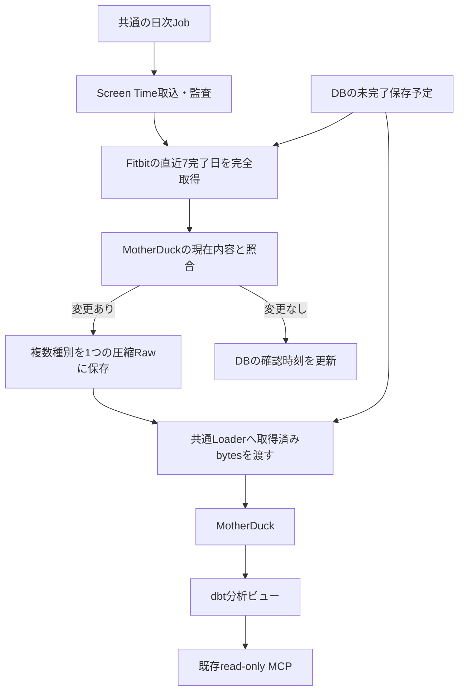

# Fitbit

Fitbit端末の歩数、心拍、日次安静時心拍、アクティブゾーン時間、睡眠を扱う。
source / streamは`fitbit / health`。毎朝04:30 Asia/Tokyoの共通Reconciliation JobからGoogle Health APIを取得する。

Screen Timeと同じGCSリポジトリ・Loader・取込台帳・transaction・leaseを使い、
日次Jobでは同じMotherDuck接続を再利用する。Macの常時稼働、Fitbit専用Service、Cloud Tasks、追加Schedulerは不要。
通常は7日分の変更を1つのRawにまとめる。長い未取得期間は7日分ずつ、1回に最大90日を補完する。
Rawは90日保持し、長期履歴はMotherDuckに残す。過去分のZIP投入は一時スクリプトによる別作業とする。

| 文書 | 内容 |
|---|---|
| [acquisition.md](acquisition.md) | 日次取得、再照合、APIの完全取得 |
| [data-model.md](data-model.md) | バッチRaw、DB状態、範囲更新、分析ビュー |
| [operations.md](operations.md) | CLI、切替、停止、復旧、検証範囲 |

日次方式の本番適用・実操作量の計測は[運用](operations.md)を参照する。
