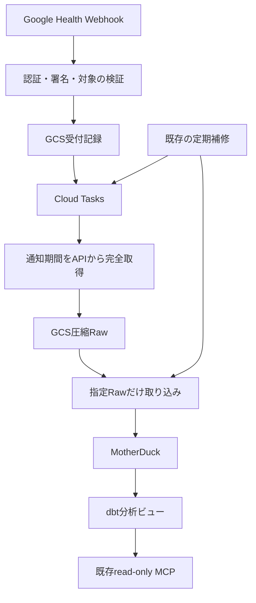

# Fitbit

Fitbit端末の歩数、心拍、日次安静時心拍、アクティブゾーン時間、睡眠を扱う。
source / streamは`fitbit / health`。Webhookを契機にGoogle Health APIから取得する。

Macの常時稼働を必要とせず、PDP専用のCloud Run ServiceとCloud Tasks queueを1つずつ使う。
アプリは継続取り込み・復旧・分析を担当し、過去分のZIP投入は一時スクリプトによる別作業とする。
旧health-data-pipelineのJob・queue・Schedulerは再開せず、Notion・SVG出力や全履歴コピーは扱わない。

| 文書 | 内容 |
|---|---|
| [acquisition.md](acquisition.md) | API・Webhookの取得と認証 |
| [data-model.md](data-model.md) | Raw、テーブル、範囲更新、分析ビュー |
| [operations.md](operations.md) | CLI、導入、停止、復旧、検証状況 |

ローカル実装・検証済み。本番導入と実使用量の確認は[導入前の確認事項](operations.md#導入前の確認事項)に従う。
