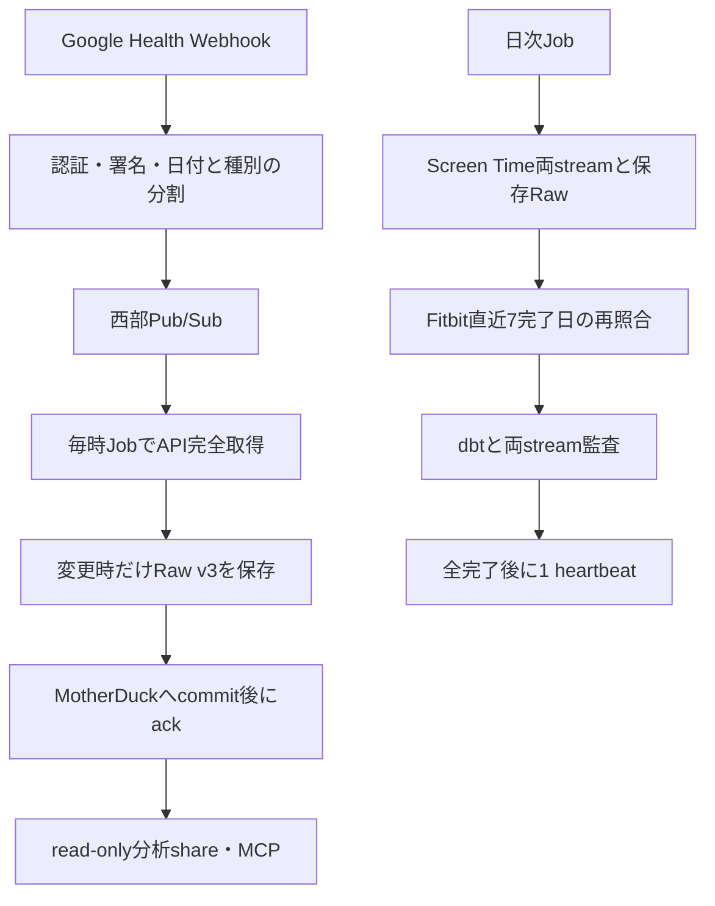

# Fitbit

Fitbit端末の歩数、心拍、日次安静時心拍、アクティブゾーン時間、睡眠を扱う。
source / streamは`fitbit / health`。Webhookを契機にGoogle Health APIから取得する。

GCP us-west1の通知専用Service・Pub/Sub・毎時Job・日次Jobを使い、MotherDuckはus-west-2へ保存する。
Mac collectorはScreen TimeのRawを公開する。Fitbitには通知台帳・自動再開cursorを設けず、
7日を超える補修は期間指定で行う。

| 文書 | 内容 |
|---|---|
| [acquisition.md](acquisition.md) | API・Webhookの取得と認証 |
| [data-model.md](data-model.md) | Raw、テーブル、範囲更新、分析ビュー |
| [operations.md](operations.md) | CLI、導入、停止、復旧、検証状況 |

切替と検証結果は[西部移行記録](../../platform/west-migration-2026-10-05.md)、停止・復旧は[運用](operations.md)を参照する。
