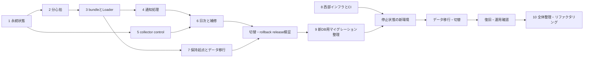

# Pub/Sub・GCS西部リージョン移行計画

- 作成日: 2026-10-05
- 状態: 未着手の実装・移行計画。チェック項目は実行結果を記録してから完了にする。
- 実装ブランチ: `feat/fitbit-pubsub-gcs-migration`
- 移行元: `main`の`adc527a`。他ブランチの機能が適用済みであるとは扱わない。

**目的:** Screen TimeのRawと分析履歴を維持し、既存Fitbitデータは全消去可能として最終スキーマから収集を開始する。Pub/Subの集約処理と1分心拍へ切り替え、GCPの地域を選べるリソースを`us-west1`、MotherDuckを`us-west-2`へ移す。切替後に移行用の互換処理を撤去し、コード・設定・文書を整理する。

**構成:** 受信Serviceが検証済み通知をPub/Subへ発行し、毎時Jobがまとめて取得・commit・ackする。日次JobはScreen Timeの取り込み・監査とFitbitの補修を行う。RawはGCSに90日、永続進捗と分析データはMotherDuckに保存する。

**技術:** Python 3.13以上、DuckDB 1.5.5、dbt-duckdb、Google Health API v4、Pub/Sub Python SDK、Cloud Run、GCS、Terraform 1.15.9。

**仕様:** [移行設計](../specs/2026-10-05-pubsub-gcs-migration-design.md)。保存・指標・失敗時の動作の正本とし、この文書では作業順序と確認方法を定める。

## 共通条件

- Rawは90日。新規は`age=90`、移行コピーは元の作成日時を`Custom-Time`に設定し`daysSinceCustomTime=90`。削除猶予3日を監査に反映する。
- Pub/Sub未ack保持は7日。最大500通知・収集2分、ack延長は単発600秒以内。受信後の取得attemptが必要範囲すべてで完了してからackする。
- 毎時Jobのtimeoutは50分、日次は100分。全writerで共通`loader` lease 125分を使い、所有権・残り時間を確認する。
- Fitbit bundleは圧縮16MiB/object以内。全chunkが揃うまでその取得範囲を完了にしない。
- 心拍は60秒窓、Google wearables由来、UTC分境界、1リクエスト14日以内、全ページ取得。API由来の元サンプル数はNULL。
- Screen Timeは30分scan、変更segmentのRaw保存、control公開24時間、監査鮮度48時間。次のsegmentが現れるまで最新未完了segmentを保留する。
- 定常時のSchedulerは2つ。容量・操作・実行量は無料枠の70%以下、secret active versionは6個以内を目標にする。
- 既存Fitbitの分析データ・Raw・receipt・checkpoint・通知/取得状態は全消去可能とする。旧履歴のコピー・秒心拍の全期間変換・過去履歴の完全復元は移行条件にしない。新環境で新規取得を確認し、過去のbackfillは必要な期間だけ任意に実施する。
- Screen Timeと共通基盤の履歴は保存する。Fitbitだけを削除・再作成できる範囲を明示し、共有bucket・DB・台帳の全消去をしない。既存DBの適用済みSQL/checksumは維持し、新DB専用のFitbit baselineへ整理する。旧migration台帳を新DBへコピーしたり適用済みと見せたりしない。
- 新モデルに対応したrollback releaseとScreen Timeの復旧入力は切替・復旧確認まで確保する。全体整理は機能追加と別commitにし、データ再構築や廃止作業と挙動を保つリファクタリングを区別する。
- 変更は機能単位でローカルcommitする。実装・クラウド適用・切替の検証結果は区別して記録する。

## 重点確認

| 条件 | 期待する動作 | 検証する作業 |
| --- | --- | --- |
| 同一内容の新しい通知、取得開始後に届く通知 | 過去の完了だけでackせず、新しい取得に対応する | 1・4 |
| API未知項目、ページ順変化、空結果、途中失敗 | 内容を保存し、完全取得だけで置換・削除する | 2・3 |
| commit応答消失、ack期限切れ、lease競合 | 台帳を確認し、再配信・延期から復旧する | 1・4・6 |
| PC再起動、bucket変更、inactive/reactivation | pendingを保持し、新宛先のcontrolを直ちに公開する | 5・7 |
| コピー後の期限・generation、Fitbit状態のリセット | Screen Timeと共有台帳を保持し、Fitbitは旧状態なしで新規取得できる | 2・7・9・切替 |
| baseline適用先の取り違え、整理後の契約の変化 | 既存DBを保護し、再構築・再適用・新経路の動作を維持する | 9・10 |

## ファイルの分担

以下の新規ファイルとインターフェースは実装予定であり、現在存在するものではない。

| 作業 | 主な変更先 | 責務 |
| --- | --- | --- |
| 1 | `migrations/005_fitbit_acquisition_work.sql`、`sources/fitbit/acquisition_state.py`、`models.py` | 通知・取得attempt・bundle予定・補修cursor |
| 2 | `migrations/006_fitbit_heart_rate_minute.sql`、Fitbit API/model/writer、dbt | 心拍の分モデルと新指標 |
| 3 | Fitbit `raw.py`・`adapter.py`・`writer.py`、`loader/job.py` | v2 bundle、検証済みbuffer取り込み |
| 4 | Fitbit `notifications.py`・`acquisition.py`・`service.py`・`runtime.py`・`cli.py` | Pub/Sub境界と毎時Job |
| 5 | Screen Time `state.py`・`collector.py`・`cli.py`・`audit.py` | control公開と永続的な端末状態 |
| 6 | `reconciliation/job.py`、Fitbit runtime、`dbt_runner.py` | 共通lease、日次処理、補修・手動処理 |
| 7 | `migrations/007_raw_retention_origin.sql`、Raw/storage/recovery、移行script | Screen Timeの保持起点・コピー、Fitbit新規取得 |
| 8 | `infra/bootstrap`、`infra/terraform`、CI workflow | 西部の並行環境・IAM・image・監視 |
| 9 | `migrations/west/`、`storage/motherduck.py`、移行script、schemaテスト | 新DB専用baseline、Fitbitマイグレーション統合 |
| 10 | Fitbit取得/配送/Raw、共通Job、infra/CI、tests、docs | 旧経路撤去、責務分割、設定・依存・文書の整理 |

Pythonの省略したpathは`src/personal_data_platform/`配下とする。API取得はFitbit API module、source固有SQLは`acquisition_state.py`、配送SDKは`notifications.py`に集める。汎用`Warehouse`へ配送固有のメソッドを増やさない。



## 実装作業

### 1. 通知と取得attemptの永続状態

**Files:** 新規`src/personal_data_platform/migrations/005_fitbit_acquisition_work.sql`、`sources/fitbit/acquisition_state.py`。変更`models.py`、`storage/motherduck.py`。テスト`tests/integration/test_migrations.py`、新規`tests/integration/test_fitbit_acquisition_state.py`。

**Interfaces:** `models.py`に`AcquisitionScope(subject_key: str, window: Window, aggregation_version: str)`と`Notification(notification_id: str, subject_key: str, windows: tuple[Window, ...], received_at: datetime)`を定義する。`AcquisitionState(warehouse: Warehouse)`は`register_notifications(notifications: tuple[Notification, ...]) -> Mapping[str, tuple[AcquisitionScope, ...]]`、`start_attempt(scope: AcquisitionScope, *, started_at: datetime) -> str`、`bind_attempt(notification_ids: tuple[str, ...], scope: AcquisitionScope, attempt_id: str) -> None`、`ackable_ids(notification_ids: tuple[str, ...]) -> frozenset[str]`を提供する。

`prepare_bundle(bundle_id: str, attempt_ids: tuple[str, ...], chunks: tuple[tuple[str, str, int], ...]) -> None`はchunkのkey・圧縮SHA-256・圧縮sizeを保存する。`finish_attempt(attempt_id: str, *, source_sha256: str, raw_keys: tuple[str, ...]) -> None`は呼び出し側の取り込みtransaction内でのみ実行し、自身ではcommitしない。unchangedの成功もこの関数で記録する。

- [x] `test_old_success_does_not_complete_new_notification`を追加する。既存success後に登録した通知について`assert state.ackable_ids((new_id,)) == frozenset()`。同じ取得へ対応できるのは開始前に受信済みの通知だけとする。
- [x] 複数scope・部分commit・結果不明commit・再配信のテストを追加し、`python -m pytest tests/integration/test_fitbit_acquisition_state.py -q`で新機能がないためFAILすることを確認する。
- [x] notification/scope/attempt、bundle/chunk intent、成功台帳、補修cursorのtableを追加する。通知対応をAPI取得前、intentをGCS保存前に確定する。成功確認とデータ反映は同じDB transactionで行い、未知commitを新しい接続で確認する。
- [x] 上記テストと`python -m pytest tests/integration/test_migrations.py tests/integration/test_fitbit_writer.py -q`を実行し、全件PASS、legacy集合の001〜004のchecksum維持、再migrationでデータ保持を確認する。
- [x] commit: `feat: Fitbit通知と取得attemptの永続状態を追加`

### 2. 心拍rollUpと分単位モデル

**Files:** 新規`src/personal_data_platform/migrations/006_fitbit_heart_rate_minute.sql`。変更Fitbit `api.py`・`models.py`・`writer.py`・`adapter.py`、`dbt/models/sources.yml`・`schema.yml`。新規`dbt/models/marts/fitbit_heart_rate_minute_time_series.sql`・`daily_fitbit_heart_rate_minute.sql`。テスト`tests/unit/test_fitbit_api.py`、`tests/integration/test_fitbit_analytics.py`。

**Interfaces:** `HeartRateMinute`は窓start/end、avg/min/max、data source family、`sample_count: int | None`、origin、aggregation versionを持つ。`HealthClient.fetch_heart_rate_minutes(window: Window, *, subject_key: str) -> HeartRateMinuteSnapshot`を追加する。snapshotはsubject/window、`minutes: tuple[HeartRateMinute, ...]`、`pages: tuple[dict[str, object], ...]`、取得開始時刻を持つ。旧`HealthClient.fetch(window: Window, *, subject_key: str) -> Snapshot`の非心拍利用は維持し、心拍の呼び出し元を新APIへ移す。旧秒心拍モデルを新DBに作らない。

- [x] `test_rollup_uses_complete_utc_minutes_and_all_pages`と`test_rollup_missing_is_not_zero`を追加する。`assert request_window_size == "60s"`、`assert api_row.sample_count is None`、当日末尾の未完了分と非着用窓を除外する。
- [x] `test_minute_daily_average_has_observed_minute_semantics`を追加する。元サンプル数が異なる2分の平均が60・100なら`assert mean_minute_heart_rate == 80`、`assert observed_heart_rate_minutes == 2`。該当テストを実行し、既存scalar実装ではFAILすることを確認する。
- [x] 14日分割・全page検証・未知項目保持・窓の重複/範囲不整合検証を実装する。新tableは`base.fitbit_heart_rate_minute`とし、provider sample IDを捏造しない。新view/指標で意味を明示する。新DBのdbtは旧秒心拍table/viewに依存しない構成にする。
- [x] `python -m pytest tests/unit/test_fitbit_api.py tests/integration/test_fitbit_analytics.py tests/integration/test_fitbit_writer.py -q`で全件PASS。完全な空結果は削除、途中page失敗は取得済みの新データを保持し、旧心拍tableがなくてもdbtが動くことを確認する。
- [x] commit: `feat: Google Healthの1分心拍集約と分析モデルを追加`

### 3. v2 bundleとbuffer Loaderへの切替

**Files:** 変更Fitbit `models.py`・`api.py`・`raw.py`・`adapter.py`・`writer.py`、`loader/job.py`。新規`tests/unit/test_fitbit_bundle.py`、変更`tests/integration/test_fitbit_loader.py`・`test_fitbit_service.py`・`test_loader_job.py`。

**Interfaces:** 非心拍は`HealthClient.fetch_captured(window: Window, *, subject_key: str) -> CapturedSnapshot`で取得する。`CapturedSnapshot(snapshot: Snapshot, pages: tuple[dict[str, object], ...])`を`models.py`へ追加する。`BundleEntry(attempt_id: str, acquisition: CapturedSnapshot | HeartRateMinuteSnapshot)`と`FitbitBundle(bundle_id: str, entries: tuple[BundleEntry, ...])`を定義し、問い合わせ条件・chunk index/countもRawに含める。`encode_bundle(bundle: FitbitBundle) -> tuple[tuple[str, bytes], ...]`はcreate-onlyのv2 keyと圧縮payloadを返す。

既存`run_loader_objects(repository, warehouse, observations, *, source, _lease_owner=None)`へ`buffered_payloads: Mapping[str, bytes] | None = None`を追加し、既存の検証経路で展開後hashを確認する。v2複数chunkはbundle単位で全payloadを検証・再構成し、取得範囲のデータ・全Raw台帳・`finish_attempt`を同じtransactionで反映する。Screen Timeは既存のobject単位処理を維持する。新DBでは旧Fitbit v1を取り込み対象にしない。

- [x] `test_bundle_preserves_unknown_page_fields_and_chunks`、`test_buffered_load_has_no_storage_read`を追加する。`assert get_calls == 0`、`assert list_calls == 0`、`assert max(map(len, compressed_chunks)) <= 16 * 1024 * 1024`。新API用の全page取得とScreen Timeの既存取り込みを区別する。
- [x] page順/分割だけの変化、A→B→A、途中chunkだけの取り込み、未知項目の変化をテストし、新仕様が未実装でFAILすることを確認する。
- [x] `raw/fitbit/v2/`にbundleを追加し、`FitbitSource`をv2取り込みへ切り替える。旧Fitbit v1の復元互換は新構成の要件にしない。圧縮hash/sizeと展開後`RawObject.sha256`を区別する。intentから必要な全chunkを復旧し、scopeの一部だけで削除・成功確定をしない。
- [x] `python -m pytest tests/unit/test_fitbit_bundle.py tests/integration/test_fitbit_loader.py tests/integration/test_fitbit_service.py tests/integration/test_loader_job.py -q`で全件PASS。通常時GET/LISTなし、保存後停止はgeneration固定Rawから復旧、旧Fitbit v1を誤取り込みせず、両Screen Time streamが維持されることを確認する。
- [x] commit: `feat: Fitbit Rawをbundle保存とbuffer取り込みに対応`

### 4. Pub/Sub受信と毎時Job

**Files:** 新規Fitbit `notifications.py`・`acquisition.py`。変更`service.py`・`runtime.py`・`cli.py`・`oauth.py`・`pyproject.toml`。新規`tests/unit/test_fitbit_notifications.py`・`tests/integration/test_fitbit_acquisition.py`、変更`tests/unit/test_fitbit_runtime.py`・`tests/unit/test_fitbit_api.py`・`tests/integration/test_fitbit_service.py`。

**Interfaces:** `Delivery(notification: Notification, ack_id: str, message_id: str)`。`PubSubNotifications.publish(notification: Notification) -> str`は成功確定まで待つ。`pull(*, limit: int, timeout_seconds: float) -> tuple[Delivery, ...]`、`extend(ack_ids: tuple[str, ...], *, seconds: int) -> None`、`ack(ack_ids: tuple[str, ...]) -> None`を提供する。`run_notification_job(*, max_messages: int = 500, collect_seconds: int = 120, timeout_seconds: int = 3000) -> AcquisitionSummary`を`pdp fitbit ingest-notifications`へ接続する。

`AcquisitionSummary`は完了/失敗/延期scope数、ackした通知数、全対象完了を表す`ok: bool`を持つ。`PDP_FITBIT_DELIVERY_MODE=legacy|pubsub`を設定し、移行期間はlegacyを既定とする。新modeのOAuthは`PDP_FITBIT_OAUTH_CONFIG`のJSON（client_id/client_secret/refresh_token/health_user_id）、受信は`PDP_FITBIT_WEBHOOK_CONFIG`のJSON（authorization/health_user_id）から読み、受信側へOAuth設定を渡さない。

- [x] `test_receiver_requires_all_publishes_before_204`、`test_empty_pull_opens_no_warehouse`を追加する。発行結果不明はnon-2xx、検証handshakeは200、`assert warehouse_connections == 0`。既存Authorization・Tink・ユーザー/5種別・サイズ・civil範囲テストを維持する。
- [x] `test_old_success_and_late_notification_need_new_attempt`、`test_ack_waits_for_every_scope`、`test_collect_extends_all_pending_deliveries`を追加し、`python -m pytest tests/unit/test_fitbit_notifications.py tests/integration/test_fitbit_acquisition.py -q`でFAILを確認する。
- [x] `google-cloud-pubsub>=2,<3`を追加し、Python 3.13で依存解決を確認する。SDKをregional endpointへ接続し、同一scopeをまとめて取得する。lease競合は期限0で再配信、処理中は全ack IDを600秒以内で延長する。各phaseに時間/件数上限を設ける。secret JSONの欠落・競合・不正値を検証し、例外に秘密情報を含めない。
- [x] 同じテストで全件PASS。API成功→GCS→DB→ackの各停止位置とcommit応答消失を障害注入し、再配信後のDB結果と完了判定を照合する。旧Cloud Tasks受信/workerは切替前だけlegacy modeに残す。旧未処理データの排出は移行条件にせず、切替時は旧投入を止めて新Pub/Subへ揃える。
- [x] commit: `feat: Fitbit WebhookをPub/Sub受信と毎時集約処理に対応`

### 5. Screen Time controlの24時間公開

**Files:** 変更Screen Time `state.py`・`collector.py`・`cli.py`・`audit.py`。テスト`tests/unit/test_collector_state.py`・`tests/contract/test_screen_time_collector_contract.py`・`test_mac_app_usage_collector.py`・`tests/integration/test_reconciliation_job.py`。

**Interfaces:** `CollectorState.control_due(*, stream: str, device_key: str, destination: str, config_digest: str, control_kind: str, now: datetime) -> bool`、`mark_control_published(*, stream: str, device_key: str, destination: str, config_digest: str, control_kind: str, published_at: datetime) -> None`。SQLiteでreceipt/manifestごとの成功時刻とinactive/reactivationを保持する。

- [x] `test_control_is_due_at_24_hours_and_on_destination_change`を追加する。`assert not due_at_23h59m`、`assert due_at_24h`、`assert due_after_bucket_change`。Rawの変更uploadがcontrol間隔で遅れないことも確認する。
- [x] 片方のcontrol失敗、再起動、sleep、allowlist変更、新端末、inactive/reactivationをテストしてFAILを確認する。
- [x] controlだけを24時間間隔にし、未成功のcontrolは次scanで再試行する。監査鮮度を48時間へ変更する。30分scan、未完了segmentの保留、ローカルpending payload、両streamのRaw形式を維持する。
- [x] `python -m pytest tests/unit/test_collector_state.py tests/contract/test_screen_time_collector_contract.py tests/contract/test_mac_app_usage_collector.py tests/integration/test_reconciliation_job.py -q`で全件PASS。`test_waits_through_updates_and_restart_until_successor_exists`とpending復旧の既存テストもPASSすることを確認する。
- [x] commit: `feat: Screen Time controlの24時間公開と永続状態を追加`

### 6. 共通lease・日次処理・補修

**Files:** 変更`loader/job.py`・`reconciliation/job.py`・`reconciliation/heartbeat.py`・`dbt_runner.py`、Fitbit `runtime.py`・`cli.py`・`acquisition_state.py`。テスト`tests/integration/test_reconciliation_job.py`・`test_fitbit_repair_runtime.py`・`test_loader_job.py`、`tests/unit/test_fitbit_cli.py`・`test_dbt_runner.py`。

**Interfaces:** 日次`run_reconciliation_from_env()`を共通leaseの外側ownerにする。内部Loaderは既存`_lease_owner`、`run_dbt_from_env(*, source_id: str | None = None, stream: str | None = None, lease_owner: str | None = None) -> int`は同じownerを引き継ぐ。`run_daily_repair(*, now: datetime, lease_owner: str, timeout_seconds: int) -> AcquisitionSummary`を追加する。期間指定は既存`pdp fitbit sync --from START --to END`を新取得経路へ接続し、`--resume-id`で永続cursorから再開する。日次/streamのheartbeat URLは`PDP_HEARTBEAT_CONFIG`のJSONから読み、legacy modeは既存設定を維持する。

- [x] `test_daily_failure_does_not_advance_success_heartbeat`、`test_all_writers_share_loader_lease`を追加する。Fitbit・dbt・片方streamの失敗で`assert heartbeat_successes == 0`、競合で他ownerのleaseを解放しない。
- [x] 7日超の停止、古い通知、広いbackfill、部分失敗cursor、paused/deferredと実失敗をテストしてFAILを確認する。
- [x] 取り込み→Fitbitの7完了日/未完了cursor補修→dbt→両stream監査の順にし、required phaseが全完了してから日次heartbeatを確定する。pairedDevicesのlastSyncはnanosecondを維持してMotherDuckへ保存する。新側のcursorはAPI再取得で初期化し、旧GCS checkpointの成功範囲をそのまま成功扱いにしない。対象範囲のcommit前にcursorを進めない。streamごとのinventoryをLoaderと監査で共用する。155分の独立reconciliation leaseと手動dbtの無排他経路を新modeで使わない。
- [x] `python -m pytest tests/integration/test_reconciliation_job.py tests/integration/test_fitbit_repair_runtime.py tests/integration/test_loader_job.py tests/unit/test_fitbit_cli.py tests/unit/test_dbt_runner.py -q`で全件PASS。50/100分の終了上限、125分lease、所有権喪失時の停止、DB/API timeoutを確認する。手動sync/dbtも対象にし、補修上限に達したcursorを成功完了として進めない。
- [x] commit: `feat: 収集処理を共通leaseと日次再照合へ統合`

### 7. Screen Timeの保持起点・コピーとFitbit初期化

**Files:** 新規`src/personal_data_platform/migrations/007_raw_retention_origin.sql`、`scripts/migrate_west_raw.py`・`migrate_west_warehouse.py`。変更`raw/models.py`・`storage/gcs.py`・`storage/gcs_types.py`・`storage/motherduck.py`・`reconciliation/job.py`・`recovery/rebuild.py`。新規`tests/unit/test_west_raw_migration.py`・`tests/integration/test_west_warehouse_migration.py`、変更`tests/unit/test_gcs_repository.py`・`tests/unit/test_rebuild.py`・`tests/integration/test_fitbit_analytics.py`。

**Interfaces:** `RawObject.retention_started_at: datetime | None = None`を追加し、未設定時は`storage_created_at`を保持起点にする。移行scriptは`--inventory-only`、`--copy`、`--verify`、再開manifestを扱う。Fitbitは作業6の`pdp fitbit sync --from START --to END --resume-id ID`で新規取得し、旧データ変換用の移行関数は追加しない。

warehouse scriptは旧組織の読み取り、新組織の書き込みを別接続にし、local DuckDBを経由してScreen Timeと移行対象の共通データを移す。`--export`・`--import`・`--verify`・`--final-delta`を提供する。table・共通台帳のsource別allowlistを固定し、Fitbit専用table・`ops.schema_migration`・active leaseをimportしない。新DBは作業9のbaselineで初期化する。最終差分はScreen Timeの更新・削除とRaw参照mappingを反映し、新側のFitbit tableを旧snapshotで上書きしない。viewはdbtで再作成する。

- [x] `test_copy_preserves_retention_origin_and_changes_generation`を追加する。`assert retention_started_at == original_created_at`、コピー先の実作成日時・generationは新値とし、90日/93日監査が元期限で動くことを確認する。
- [x] inventoryからgenerationが消える、hash不一致、コピー途中停止、再実行、Fitbit旧台帳の混入、API再取得の部分失敗をテストしてFAILを確認する。
- [x] Screen Timeの旧bucketからgeneration固定で読み、圧縮hash/sizeと元保持起点を検証してcreate-onlyでコピーする。mappingを台帳へ反映し、未完了取り込みも対象にする。Fitbitは作業6の期間指定syncで直近の代表期間を取得し、新Raw・分心拍・進捗を新規に作る。通常取り込みと同じlease・時間上限を使う。過去のbackfillを行う場合は永続cursorで日を分割する。
- [ ] 直近の全種別の取得完了範囲、重複、歩数/睡眠などの代表集計、心拍の観測分数を確認する。分心拍はAPI由来として元sample countをNULLにし、旧履歴との件数一致を移行条件にしない。
- [x] `python -m pytest tests/unit/test_west_raw_migration.py tests/integration/test_west_warehouse_migration.py tests/unit/test_gcs_repository.py tests/unit/test_rebuild.py tests/integration/test_fitbit_analytics.py -q`で全件PASS。再実行で既存コピーを再保存せず、Screen Timeを保持し、Fitbitは旧データ/進捗なしでも新規取得できることを確認する。任意backfillの未取得範囲は定常処理の失敗と区別し、未実装のTakeout取り込みを復旧手段に数えない。
- [x] commit: `feat: Rawの保持起点と西部DB用baselineを追加`と`feat: Screen Timeの西部コピーと照合処理を追加`

### 8. 西部インフラとCIの並行構成

**Files:** 変更`infra/bootstrap/main.tf`・`variables.tf`・`identity.tf`・`storage_roles.tf`・`terraform.tfvars.example`・`tests/bootstrap.tftest.hcl`、`infra/terraform/{variables,storage,secrets,jobs,sources,scheduler,fitbit,monitoring,main,outputs}.tf`・`terraform.tfvars.example`。新規`infra/terraform/pubsub.tf`・`logging.tf`。変更`.github/workflows/terraform-plan.yml`・`terraform-deploy.yml`・`ci.yml`、`tests/infra/test_gcp_contract.py`とruntime/fitbit Terraform tests。

**Interfaces:** 旧addressを維持し、新規に`google_storage_bucket.terraform_state_west`・`raw_west`・`preflight_west`、`google_artifact_registry_repository.runtime_west`、Cloud Run/ Schedulerの`west` resourceを追加する。region指定は`us-west1`。出力で新bucket、repository、Job、Service、secret、Pub/Subを識別する。CIのstate参照は既存`TF_STATE_BUCKET`を使い、backend prefixは維持する。

- [x] mock Terraform testsに西部location、旧資産destroyなし、Raw/preflight/stateの別bucket、Pub/Subの保存/通信制限、権限分離、secretの単一replica、停止した新Schedulerを追加する。旧固定regionテストを新旧並行契約へ変更してFAILを確認する。
- [x] `test_deploy_protects_job_and_service_images_during_migration`を追加する。旧Jobだけでなく受信Serviceのrevision、rollback用digestも保護する。旧regionのimageを新region用fallbackとして誤利用しない。
- [x] bootstrapとruntimeに西部resourceを追加する。受信Serviceはtopic publisher、Jobはsubscription subscriberと対象Rawの読み書きだけを持ち、v2 prefixもbucket IAMへ追加する。Secret Managerはglobal resource＋user-managed単一replicaの新IDとし、payloadはTerraform stateへ入れない。通常logは西部bucketへ`_Default` sinkを切り替え、`_Required`は維持する。deploy identityへ必要なPub/Sub管理権限を追加し、WIFのmain限定とread-only plan identityを維持する。
- [x] CIのimage path、describeするJob、preflight/dbt対象、地域・Jobを含む監視filterを揃える。準備段階で新production Jobやdbtを自動実行しない。`terraform fmt -check -recursive infra`、各rootの`init -backend=false -lockfile=readonly`→`validate`→`test`、`python -m pytest tests/infra/test_gcp_contract.py -q`で全件PASSを確認する。
- [x] commitは`feat: 西部GCPリソースの並行構成を追加`と`ci: 西部リージョン切替とimage保護に対応`に分ける。

### 9. 新DB用Fitbit baselineとマイグレーション整理

作業1〜7の追加migrationは開発・旧環境対応の途中形とする。最終スキーマが固まった後、西部の新DBを作る前にFitbit関連DDLを統合する。空DBの作成と、旧DBへのforward migrationを別経路として扱う。

**Files:** 新規`src/personal_data_platform/migrations/west/001_initial.sql`・`002_screen_time_app_usage_platform.sql`・`003_fitbit_baseline.sql`・`004_raw_retention_origin.sql`、`scripts/cleanup_fitbit_legacy.py`。変更`storage/motherduck.py`・`config.py`・migration呼び出し元、`scripts/migrate_west_warehouse.py`、`pyproject.toml`。テスト`tests/integration/test_migrations.py`、新規`tests/integration/test_west_migration_baseline.py`・`test_fitbit_legacy_cleanup.py`。

**Interfaces:** 移行中の`Warehouse.migrate(migrations: Path | None = None, *, profile: Literal["legacy", "west"] = "legacy") -> None`でlegacy/westのmigration集合を明示する。runtimeの`PDP_SCHEMA_PROFILE`とCLI/preflightも同じ選択を使う。明示pathはテスト用に維持し、DB側のmigration履歴とprofileが合わなければSQL適用前に停止する。

`cleanup_fitbit_legacy.py --inventory-only`は旧DB/bucket/queue ID、対象table/行/objectとgenerationをmanifestへ出し、`--apply MANIFEST`は同じ旧対象だけを削除する。DBの`base.fitbit_*`・`ops.fitbit_*`はinventoryで確定したtable名、共有`ops.ingestion_metadata`は`source_id='fitbit'`の行、GCSは旧bucketの`raw/fitbit/v1/`（device-sync controlを含む）と`receipts/fitbit/v1/`、Cloud Tasksは旧Fitbit queueに限定する。secret/tokenと共通migration台帳はデータ削除に含めず、新DB/bucket/queue IDを拒否する。

- [x] `test_west_baseline_creates_only_final_fitbit_schema`を追加する。空DBに通知/attempt/bundle/cursor、最終的な非心拍table、`base.fitbit_heart_rate_minute`が作られ、旧秒心拍table・旧receipt向けintentが作られないことを確認する。
- [x] `test_west_baseline_rejects_legacy_database`、`test_west_migration_reapply_preserves_screen_time_and_fitbit`を追加する。legacyのmigration履歴があるDBには適用せず、同じwest集合の再適用ではデータ・台帳が変わらないことを確認する。該当テストを実行し、未実装のためFAILすることを確認する。
- [x] `001`・`002`は既存SQLとbyte単位で同一に保つ。`003_fitbit.sql`・`004_fitbit_acquisition.sql`・作業1/2のDDLを最終定義の`003_fitbit_baseline.sql`へまとめ、不要な旧tableや途中のALTERを外す。共通保持起点は`004_raw_retention_origin.sql`へ分ける。新DBの`ops.schema_migration`はこの集合を実際に適用して作り、旧台帳をコピーしたりchecksumを手で更新したりしない。
- [ ] 既存rootのSQLは旧環境の停止まで変更せず残す。移行scriptのScreen Time importとbaselineを組み合わせ、旧FitbitデータなしでAPI再取得できることをscratch DBで確認する。API取得失敗でScreen Timeや共通台帳をclearしない。
- [ ] DBを戻すrollbackも別の空DBをbaselineで初期化して検証する。旧DBにwest集合を直接適用せず、Screen Timeのbackup/切替後差分を取り込み、Fitbitの新規取得を確認する。
- [x] `test_legacy_cleanup_preserves_screen_time_and_schema_migrations`、`test_legacy_cleanup_rejects_new_resources`を追加する。Fitbit/Screen Timeが混在するfixtureでFitbitだけが消え、新Pub/Sub・v2 Raw・取得状態が維持されること、inventory-onlyで削除が起きないこと、再実行が安全なことを確認する。停止した旧writerだけを削除対象にし、GCS削除はgenerationを照合する。
- [x] `python -m pytest tests/integration/test_migrations.py tests/integration/test_west_migration_baseline.py tests/integration/test_west_warehouse_migration.py tests/integration/test_fitbit_legacy_cleanup.py -q`で全件PASS。作業1〜7の到達スキーマとbaselineの必要table/column/constraintを比較し、package buildにwest SQLが含まれること、再構築途中停止とresumeを確認する。
- [x] baselineを`feat: Rawの保持起点と西部DB用baselineを追加`、削除scriptを`feat: 旧Fitbitデータの限定削除を追加`へ分けた。

### 10. 切替後のコード・設定・文書の整理とリファクタリング

本番手順Gの受入・復旧確認後に実施する。作業9のbaselineを通常運用の正本にし、移行期間だけ必要だった分岐を撤去する。Fitbitの旧入力は保存せず、旧経路の廃止と動作を変えない責務分割は別commitで確認する。

**Files:** Fitbit `runtime.py`・`service.py`・`acquisition.py`・`notifications.py`・`acquisition_state.py`・`api.py`・`raw.py`・`writer.py`・`receipts.py`・`sync_state.py`、`loader/job.py`・`reconciliation/job.py`・`dbt_runner.py`・`storage/motherduck.py`・`config.py`、`migrations/`、`scripts/migrate_west_*.py`、`pyproject.toml`、`infra/{bootstrap,terraform}`、`.github/workflows/`、関連testsと`README.md`・`docs/{platform,sources,analytics}`。

**維持する契約:** Webhook検証と発行完了後204、pull→取得→Raw→DB commit→ack、空pullでDB接続なし、共通lease、分心拍の指標、Screen Timeのsegment保留/24時間control/48時間監査、保持期限と既存CLIの確定した引数。

- [ ] `rg`でCloud Tasks、legacy mode、GCS receipt/checkpoint、旧secret/env、旧region/resource名、秒心拍view、v1 Raw decoderの参照を列挙する。通常経路・rollback専用・文書/fixtureに分け、廃止条件を満たしたものだけ撤去する。旧Fitbitデータは保存要件に含めず、v1 decoderの撤去に90日の満了待ちは不要とする。
- [ ] Cloud Tasksのworker/SDK、旧receipt/checkpoint、delivery mode切替、旧秒心拍モデル/分析参照を撤去する。baselineを既定にし、legacy schema profileと旧migration集合を実行対象から外す。旧rootとwestで重複した共通SQLを一つにし、配布packageのmigration集合も揃える。検証済みrollback releaseのSHA/image/SQLは移行記録とGit履歴で復旧可能にする。west運用開始後のschema変更は追加migrationとし、適用済みbaselineを再編集しない。
- [ ] `runtime.py`は依存の構築・設定読み込み、`notifications.py`は配送SDK、`acquisition.py`は取得の調整、`acquisition_state.py`は永続状態、`api.py`はAPI通信、`raw.py`はbundle形式、`writer.py`はデータ反映へ責務を揃える。毎時/日次/手動で重複する処理はこの境界へ集め、汎用plugin基盤や新サービスを増やさない。
- [ ] Job間で重複するlease/期限/結果の扱いとsecret設定の解析を整理する。既存の引数・成功/失敗/延期、ログの相関ID、heartbeatの条件を維持し、変更する契約は別の機能変更として扱う。
- [ ] 旧resource廃止後のTerraform address/変数/output、IAM、image保護、CI参照を西部の定常構成へ揃える。stateに残る旧addressはplan/import/movedを照合し、不要なdestroyや新bucket置換がないことを確認する。移行scriptは定常CLIから分離し、再利用しない一時処理を削除する。
- [ ] 旧経路だけを前提とするtests/fixturesを整理し、新経路の障害境界・再構築・データ保持を検証するtestsを残す。正本docsを実装と一致させ、設計/計画は実施結果と残件を記録し、READMEから現在の運用へ辿れるよう更新する。
- [ ] 整理commitごとに関連testsを確認し、最終的に`ruff check src tests`、`ruff format --check src tests`、`mypy src`、`python -m pytest -q`、package/container build、全Terraform rootの`fmt/validate/test`、`git diff --check`をPASSさせる。整理後もscratch DBの初期化→Screen Time import→Fitbit API復旧→dbt、通知の障害注入、両stream監査を再確認する。
- [ ] commitを`refactor: Fitbitの旧配送経路と互換スキーマを整理`、`refactor: 取得処理と共通Jobの責務を整理`、`chore: 移行後の設定と依存を整理`、`docs: 西部構成の運用手順を更新`へ分割する。

## 実装後のローカル検証と切替・rollback release

- [x] `ruff check src tests`、`ruff format --check src tests`、`mypy src`、`python -m pytest -q`、`git diff --check`を実行し全件PASSを記録する。
- [x] `.github/workflows/ci.yml`と同じpackage build・container build/helpを確認する。新`fitbit ingest-notifications`と期間指定のhelpも追加する。
- [ ] v2 Raw、分心拍、Screen Timeの保持起点を扱えるreleaseを確定し、commit SHA・image digest・schema versionを記録する。rollbackで同じ新Fitbitモデルを利用できる経路を検証する。旧Fitbit v1/秒心拍の読み取り維持は必要条件にしない。
- [ ] 本番を参照しないscratch DBとpreflight bucketで障害注入、baseline初期化、Screen Time移行、Fitbit再構築、dbt、両stream監査、rollback rehearsalを行う。ローカルPASSを本番成功として扱わない。

## 本番移行の順序

### A. Inventoryと費用の確認

- [ ] GCP resourceの実location、bucket/secret/version、Scheduler、実行中Job、Cloud Tasks/GCS receipt残件、MotherDuck組織・DB・table/view、全期間の件数をread-onlyで採取する。
- [ ] Screen TimeのRaw/分析データと必要な共有台帳のbackupを確保し、復元できることを検証する。MotherDuckは読み取り接続から移行対象をlocal DuckDBへ保存し、別接続で新組織へ取り込む。Fitbitの旧データ・Rawのbackupは必須にしない。bootstrapのlocal state、runtime remote state、PC SQLiteは別々に保全する。
- [ ] Fitbitの再収集開始時刻を決め、旧データ・Raw・通知/取得状態の全消去対象をinventoryする。source/prefix/table/queueのallowlistを固定し、Screen Timeと共通migration台帳を含めない。直近の代表期間を取得し、完全な空結果と取得失敗を区別する。
- [ ] Screen Time移行コピー、Fitbit初回取得と任意backfill、image/secret併存の費用・API rate limit・所要時間を見積もる。backfillを無料枠/実行時間内で分割し、通知保持期限を圧迫しない順序にする。定常無料枠と移行時費用を分ける。
- [ ] 新旧のresource ID、接続先、backup、cutover時刻、照合結果を移行記録に残す。秘密情報・健康データ本体・stateの内容をGitへ入れない。

### B. BootstrapとTerraform backend

- [ ] 旧ASIA state bucketを保護したまま、別名・別addressで西部state bucketとrepositoryを作る。stateはversioning・UBLA・public access preventionを維持し、Rawのsoft-delete/versioning設定を流用しない。
- [ ] backendを使うCIとTerraform操作を一時停止する。旧stateを安全な場所へ退避し、plan/deploy identityの新bucket権限を確認する。
- [ ] 現在のbackendを初期化済みのcheckoutで、以下を実行する。変数は移行記録の新bucket名を使う。

```bash
terraform -chdir=infra/terraform init -migrate-state \
  -backend-config="bucket=$PDP_WEST_STATE_BUCKET"
```

- [ ] prefix`personal-data-platform/runtime`、state lineage、serial、resource ID一覧、旧資産をdestroyしないplanを照合してから`TF_STATE_BUCKET`を切り替える。`-reconfigure`だけではstateのコピーにならない。[Terraform init](https://developer.hashicorp.com/terraform/cli/commands/init)
- [ ] bootstrapのlocal stateはruntime backendと別管理であることを確認する。移行済みstateを旧backendから再度書き込むCIがないことを確認してCIを再開する。

### C. 停止状態で新環境を準備

- [ ] MotherDuckの`us-west-2`組織、productionとpreflightの別接続先を準備し、作業9のbaselineで空DBを初期化する。組織・ユーザー・token・MCPの権限を確認し、`SELECT region FROM md_user_info();`で接続先の地域を照合する。[MotherDuckリージョン](https://motherduck.com/docs/about-motherduck/cloud-regions)
- [ ] 西部Raw/preflight bucket、secret、Pub/Sub、Service、Jobを作る。新Schedulerは停止し、新Jobを起動しない。旧リソースの`prevent_destroy`を維持する。
- [ ] Pub/Subを`pubsub.us-west1.rep.googleapis.com`へ接続し、保存先`["us-west1"]`、`enforceInTransit=true`、7日保持、自動期限切れなしを確認する。[Pub/Sub endpoints](https://docs.cloud.google.com/pubsub/docs/reference/service_apis_overview)
- [ ] secretは数値versionを固定して注入する。auto replicationは変更できないため新IDへ移す。Cloud Run互換のglobal secret＋単一西部replicaを使う。[Secret Manager](https://docs.cloud.google.com/secret-manager/docs/choosing-replication)、[Cloud Run secrets](https://docs.cloud.google.com/run/docs/configuring/services/secrets)
- [ ] Screen Timeの初回データと90日内Rawをコピーし、hash/size、保持起点、新generation、件数・主キー・期間・代表集計を照合する。旧migration台帳と実行中leaseを新側へimportしない。
- [ ] 本番Schedulerと通知pullを停止したまま、限定した手動syncを共通leaseで実行する。Fitbitの全種別・分心拍・Raw・取得状態を新規に作り、代表集計を確認する。旧Fitbit Raw/台帳をコピーしない。過去履歴の全期間backfillは切替条件にせず、必要なら切替後に分割して実施する。
- [ ] 切替releaseとScreen Time差分の戻し方、Fitbitを空状態から再取得するrollbackを確認する。旧Fitbit履歴の復元を要件にせず、v1 parserしかない移行元SHAをそのまま新Rawへ向けない。

### D. 受付を維持して最終差分を確定

- [ ] 新規Webhookと旧URLへの遅い再送を新Pub/Subへ発行する。新Jobはまだ起動せず、発行成功後204と最古未ack時刻を確認する。
- [ ] 旧Cloud Tasksの投入を止め、実行中処理を終える。再収集開始前のFitbit通知・receipt・intentは廃棄可能とし、旧queueの排出や状態コピーを切替条件にしない。開始時刻以降の通知は新Pub/Subで保持する。
- [ ] 旧writer・手動処理・PC collectorを停止する。実行中upload/commitが終わったこと、未解決commit、ローカルpendingを確認する。
- [ ] Screen TimeのMotherDuckとGCSの最終差分をコピーし、Raw参照と新generationを照合する。Fitbitは初回取得後〜切替までの範囲と保留通知の範囲をAPIで再照合し、旧table/checkpointで新側を上書きしない。最終コピー後に旧bucketへcollectorが書き込まない境界を守る。
- [ ] 通知保持7日以内に切替を終える。超える場合は未完了範囲を永続記録し、補修期間を確保する。MotherDuck障害で記録できない場合は停止期間を指定してbackfillする。

### E. 接続先切替と運用開始

- [ ] collectorの送信先を新bucketへ変更し、初回controlを強制公開して再開する。旧bucketでuploaded済みのsegmentが新bucketへ再送されないことを最終manifestで照合する。
- [ ] Job、分析、MotherDuck Remote MCPの接続先を新組織へ切り替える。必要なscopeの取り込みと両Screen Time streamを手動の限定実行で確認する。
- [ ] 通知Job→日次Jobの順に確認し、API・Raw・commit・ack、7完了日の再照合、dbt、監査、日次heartbeatが揃うことを確認する。
- [ ] Schedulerを毎時と04:30 Asia/Tokyoの2scheduleで有効にし、旧scheduleからの起動を止める。通常logの`_Default` routingを西部へ変更し、二重保存しないことを確認する。既存`_Required`は残す。[Logging地域化](https://docs.cloud.google.com/logging/docs/regionalized-logs)
- [ ] 最古未ack12時間、control鮮度48時間、日次未完了、認証/保存失敗の警報を確認する。起動受付だけを成功としない。

### F. Rollback

- [ ] 新writer・collectorを止め、旧側も停止した状態でScreen Timeの切替後Raw/commit差分と、新Fitbit通知・補修範囲をinventoryする。
- [ ] 西部warehouseが正常ならDBは維持し、実行系だけ戻す。DBも戻す場合はrollback用の別DBをbaselineで初期化し、Screen Timeのbackup/切替後差分を取り込む。旧DBへwest集合を直接適用しない。保持起点・generation・取り込み台帳を照合する。
- [ ] Fitbitは旧履歴の復元ではなく、通知の引継ぎとAPI再取得で再開する。新モデルを扱える検証済みreleaseと接続先を復元し、新側のFitbitを消す場合は再収集開始時刻・補修範囲を記録する。
- [ ] Webhookを継続受付できる経路へ戻し、collectorのcontrolを強制公開して再開する。再照合・両stream監査後に旧Schedulerを再開する。
- [ ] 双方が同時にwriteしないこと、Screen Timeの切替後の履歴が消えず、Fitbitが記録した開始時刻から再収集できることを確認する。原因・未完了範囲・次の試行条件を記録する。

### G. 旧資産の整理と費用確認

- [ ] 切替後7日・30日のGCS容量/Class A/B、Pub/Sub量/再配信/滞留、Cloud Run課金秒/転送、MotherDuck容量/CUh、imageとsecret version、Logging使用量を確認する。
- [ ] 受入・rollback確認後、旧Scheduler・Cloud Tasks・旧Runを廃止する。旧secret versionとimageは復旧手段を確認して整理し、state bucketの旧更新がないことを確認する。
- [ ] 新Fitbit取得と利用先切替を確認してから、inventoryした旧Fitbit table/Raw/receipt/checkpoint/取得状態を削除する。共有台帳はFitbit行だけ、GCSはFitbit prefixだけを対象にし、共通schemaやScreen Timeを削除しない。新Pub/Subと新取得台帳を旧状態の削除対象に含めない。削除件数と残存参照を確認し、v1 decoder撤去に90日の満了を待たない。
- [ ] 作業10のコード・マイグレーション経路・設定・文書の整理を実施し、最終検証結果とcommitを記録する。
- [ ] 無料枠の目標を満たした測定期間・使用量・超過要因を記録して移行完了とする。定常処理の未完了補修、未照合のScreen Time履歴、未検証rollback、旧経路や整理作業の残件を残したまま完了にしない。

## 現在の検証状態

2026-10-05に作業1〜9のコード実装とローカル検証を完了した。実装は`feat/fitbit-pubsub-gcs-migration`に機能別でcommitしている。実環境のAPI取得・preflight・切替を含む項目は未完了のままとする。

| 検証 | 結果 |
|---|---|
| Python 3.13.7で開発依存の解決・全pytest | 777 passed。第三者ライブラリのdeprecation warning 1件 |
| Ruff check / format（src・tests・scripts）、strict mypy | PASS。mypyは59 source files |
| Terraform 1.15.9の全root | fmt、backendなしinit、validate、mock testがPASS。bootstrap 2・github 1・runtime 27 |
| wheel build | PASS。westのSQL 4件がsourceとbyte単位で一致 |
| linux/amd64 container build・起動確認 | PASS。12件のhelp/import/dbt asset/west baseline確認 |
| 障害注入 | 通知登録途中、保存応答消失、chunk欠落、bundle内書込失敗、commit前後の応答消失、ack失敗、所有権喪失、DB deadline、補修再開を確認 |
| レビュー後の回帰 | 日付を跨ぐstable IDの修正、古いlastSyncでの補修前進、取得済みprefixを期限前にcommitすることを確認 |
| legacy migration001〜004 | `29ceb28`とbyte単位で同一 |

実装release候補のcode SHAは`467a82b`。local imageは`personal-data-platform:pubsub-west-local`（linux/amd64）、digestは`sha256:66a090090771d8ac96ee1066f1a222f0b2b9633b9595bdacde6edc0f700c47b5`。これはローカルartifactであり、registryへの登録・本番deployは未実施。westのschema集合は001〜004、legacyの追加集合は005〜007で、実DBへの適用はscratchだけで確認した。

本番手順A〜G、実Google Health APIでの全種別照合、preflight bucketでの復旧・rollback rehearsal、監視の発火/復旧、無料枠の実測は残っている。作業10の旧経路撤去と整理は本番Gの受入・復旧確認後に実施する。
