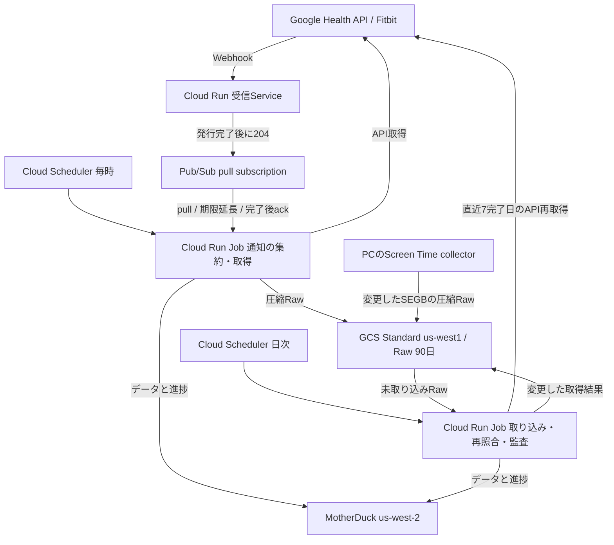

# Pub/Sub・GCSを使う西部リージョンへの移行設計

- 作成日: 2026-10-05
- 状態: 設計案。アプリケーション・Terraform・本番環境への反映は未実施。
- 移行元: `main` の `adc527a8fb25de1c93eca454aab2f39b0dec4e7c`

## 目的と採用する構成

Screen TimeとFitbitを継続収集し、取得したRawを90日保存しながら、GCSのClass A操作と実行回数を抑える。個人利用の無料枠内での運用を目標にする。無料枠は請求先アカウント内の他用途とも共有されるため、移行後の実測で判定する。

- GCPで受信・定期処理・Raw保存を行う。
- FitbitのWebhookを維持し、通知の受け渡しをPub/Subにする。
- 毎時のCloud Run Jobで通知をまとめて取得・反映する。
- 日次のCloud Run JobでScreen Timeの取り込み・監査とFitbitの再照合を行う。
- GCSにScreen Timeの元SEGBとFitbitの取得レスポンスを圧縮保存する。
- MotherDuckに分析データ、取り込み結果、保存予定、取得範囲の進捗を保存する。
- 心拍はGoogle Health APIの60秒集約を取得し、新しい分単位のモデルに保存する。
- GCPは`us-west1`、MotherDuckはAWS `us-west-2`へ移す。

通知の待ち行列はPub/Sub、取り込みに関する永続状態はMotherDuckに置く。Firestoreの導入は初期構成に含めない。

ここでの処理Jobは、現在のPythonの取得・取り込み処理をコンテナで実行するものを指す。Webhookを受けるHTTP Serviceと、時間をかけてAPIを取得するJobは責務を分ける。

## 移行元との差分

現在の仕様の正本は[基盤構成](../../platform/architecture.md)、[Fitbit取得](../../sources/fitbit/acquisition.md)、[Raw契約](../../platform/raw-data.md)、[Screen Time取得](../../sources/screen-time/acquisition.md)とする。この文書は移行後の目標仕様であり、現在の運用手順を置き換えない。

| 項目 | 移行元の`main` | 移行後 |
| --- | --- | --- |
| Fitbit通知 | GCS receipt保存、Cloud Tasks登録 | Pub/Subへ発行、毎時まとめてpull |
| Fitbit処理 | 通知ごとの処理と同期・補修 | 毎時の通知処理と日次の再照合 |
| 取得の進捗 | GCS checkpointとMotherDuckの取り込み状態 | MotherDuckの範囲別進捗・保存予定 |
| Fitbit Raw | 日・種別ごとのスナップショット | 変更した範囲をまとめた圧縮bundle |
| 心拍の分析データ | 個々の心拍サンプル | 1分の平均・最小・最大 |
| Screen Time | 定期Loaderとcollector control | 日次Loader、24時間間隔のcontrol公開 |
| リージョン | GCP `us-central1`、既存MotherDuck組織 | GCP `us-west1`、新しいMotherDuck西部組織 |

既存のGCS receipt、Cloud Tasks、GCS上のFitbit checkpointは、未処理分と移行状態を確認してから段階的に廃止する。

## 受信と通知処理

### Webhook受信Service

既存のAuthorization検証、Tink署名検証、対象ユーザー・種別・リクエストサイズの検証を維持する。検証用のハンドシェイクも維持する。通常の通知では、検証済み通知のPub/Sub発行がすべて成功した後に`204`を返す。失敗・結果不明なら成功応答を返さず、送信元の再送を受ける。[Google Health Webhook仕様](https://developers.google.com/health/webhooks)

Pub/Subメッセージには、schema version、対象ユーザー、データ種別、通知の対象範囲、受信日時、相関IDを含める。トークン・秘密鍵・健康データ本体は含めない。受信ServiceはGoogle Health APIやMotherDuckへ接続せず、GCS receiptも書かない。

発行成功後のHTTP応答消失、発行結果不明からの再試行などで同じ通知が複数回届く。通知の内容が同じでも、その後にデータが更新されることがあるため、同一内容を永続的に除外するキーにはしない。

### Pub/Sub設定

- 通常のpull subscriptionを1つ使う。通知ごとのpushによる重い処理の起動は行わない。
- 未ackメッセージの保持期間は7日。ack済み保持、topic側の追加保持、snapshotは使わない。
- subscriptionの無操作による自動期限切れを無効にする。
- メッセージの保存先を`us-west1`に制限し、`enforceInTransit`とリージョンに対応した接続先を設定する。
- 発行Serviceはpublisher権限、処理Jobはsubscriber権限を持つ。

通常配信は少なくとも1回で、順序は前提にしない。Google Health、GCS、MotherDuck、Pub/Subの間に共通トランザクションはないため、全体のexactly-onceは保証しない。再実行と再配信を冪等に処理する。[配信モデル](https://docs.cloud.google.com/pubsub/docs/subscription-overview)、[保存先制限](https://docs.cloud.google.com/pubsub/docs/resource-location-restriction)

### 毎時のFitbit Job

初期設定は1時間ごとに実行する。1回の収集は最大500通知・最大2分で打ち切り、処理全体のCloud Run timeoutを50分にする。件数・ページ数・API時間にも上限を設け、上限に達した分は次回へ繰り越す。

1. 通知を少量pullする。空ならMotherDuckへ接続せず終了する。
2. 共通のMotherDuck `loader` leaseを取得する。競合時は取得済み通知を再配信可能にして、処理を延期する。
3. 上限内で通知を集め、ユーザー・対象日・データ種別・集約条件を表す取得範囲にまとめる。通知と必要な取得範囲を永続記録してからAPI取得を始める。
4. 保存予定の復旧を先に行い、必要な範囲のGoogle Health APIを全ページ取得する。
5. 現在の同じ取得範囲の内容と比較し、変更した結果を圧縮Rawとして保存する。
6. MotherDuckへ反映し、範囲別の完了状態を記録する。
7. その通知が要求するすべての取得範囲が完了した後にackする。

物理時刻の範囲はAsia/Tokyoの日付へ分割する。睡眠・日次安静時心拍などのcivil dateはAPIの意味に従って扱う。タイムゾーンを含まない通知は、既存の保守的な範囲展開を維持する。一通知が複数日にまたがる場合、すべての範囲が完了するまでackしない。

取得中・集約待ちを含め、保持している全通知のack期限を定期的に延長する。単発の延長は600秒以内にし、クライアントの最大延長時間をJobの上限と整合させる。期限延長やackに失敗した場合は再配信を受け入れる。[lease管理](https://docs.cloud.google.com/pubsub/docs/lease-management)

内容が変わらない場合はRawも分析データも書き直さない。ただし照合成功は記録し、通知をackできる状態にする。集約した通知の件数はAPI取得回数・Raw数・MotherDuck接続回数と別に計測する。

### 日次Jobと長期停止からの復旧

日次Jobは04:30 Asia/Tokyoに実行し、timeoutを100分にする。Screen Timeの取り込み・監査、未完了の保存予定の復旧、Fitbitの直近7完了日の再照合を行う。当日の未完了範囲は毎時Jobが扱う。Schedulerは専用Service Accountで認証して`jobs.run`を呼び、各Jobの実行権限と実行時のデータアクセス権限を分ける。

再照合は、通知欠損や遅い同期を補う処理である。7日より古い更新、7日を超える停止、通知の保持期限を超えた欠損は、別の期間指定backfillで補修する。日次Jobは正常完了した日付・取得範囲を永続記録し、停止で空いた範囲を上限内で順次埋める。取得の失敗でカーソルを先へ進めない。

古い日付の通知も取得対象とし、直近7日だけに切り詰めない。広い通知・backfillは範囲ごとに分割し、通常通知とScreen Timeの処理を長期間止めない。APIが返せる履歴の範囲と権限を確認し、再取得できなかった範囲を明示する。`rollUp`の心拍の14日上限は1リクエストの範囲制限であり、保持される履歴期間を意味しない。[rollUp仕様](https://developers.google.com/health/reference/rest/v4/users.dataTypes.dataPoints/rollUp)

## 永続状態と途中失敗

### MotherDuckの状態

既存の`ops`取り込み台帳・Raw intentを基礎として、以下の状態を前方互換のmigrationで追加する。適用済みmigrationは書き換えない。

| 状態 | 保存する内容 |
| --- | --- |
| 範囲別の最新成功 | ユーザー、日・時間範囲、種別、取得・集約version、内容hash、取得時刻、Raw参照 |
| 通知の未完了範囲 | 通知ID・受信日時、必要な取得範囲、対応する取得attempt、完了状態 |
| Rawの保存予定 | bundle ID、対象範囲、object key、圧縮バイト列のhash・size、状態、保存後のgeneration |
| 取り込み結果 | bundleと範囲ごとのcommit、Raw参照、更新・削除した範囲 |
| 補修の進捗 | 次の未完了範囲、試行結果、再開位置 |

通知から取得範囲・取得attemptへの対応を保持し、範囲別に成功を確認できるようにする。Pub/Sub message IDだけをデータの識別子にしない。初めて処理する通知は、その通知を受信した後に開始した完全取得へ対応させる。同範囲の過去成功だけで新しい通知をackしない。再配信では、その通知に対応済みのattemptがすべてcommit済みなら再取得せずackできる。

分析データの更新、範囲の成功、取り込み台帳は同じMotherDuckトランザクションで確定する。Raw intentはGCS保存前に確定し、Rawから再開できる状態を残す。commit結果が不明な場合は成功扱いにせず、新しい接続で台帳を確認する。

### 失敗時の動作

| 停止・失敗した位置 | 再実行時の動作 |
| --- | --- |
| APIの途中ページ・429・通信失敗 | 範囲は未完了のまま。既存データを削除せず再取得する |
| intent確定後、GCS保存前 | objectの存在をkeyで確認。存在しなければ再取得して新しいintentを作る |
| GCS保存後、MotherDuck反映前 | hash・size・generationを検証し、保存済みRawから取り込む |
| MotherDuck commitの応答消失 | 台帳を確認して確定済みなら再書き込みを避ける。未確定なら再実行する |
| commit後、ack前 | 再配信時に状態を照合し、完了を確認してackする |
| bundleの一部範囲だけ失敗 | 成功範囲を記録し、未完了範囲を再試行する。その範囲を必要とする通知はackしない |

APIが完全に取得できて結果が空なら、その範囲の削除を反映する。途中取得・異常終了で空になった結果は削除の根拠にしない。認証・権限エラーは通常の空データと区別し、運用上の失敗として通知する。

### 同時実行の制御

毎時・日次・手動処理はすべて共通の`loader` leaseを使う。Jobの`taskCount=1`や`parallelism=1`だけでは、別実行との競合を防げない。

現在のleaseは125分固定で更新されないため、初期移行ではすべての書き込みJobを最大100分以内に制限する。API・DB呼び出しにもtimeoutを設け、終了・commit確認の余裕を残す。lease所有者を確認してから書き込み、所有権が不明・喪失した場合は続行しない。125分を超える処理が必要になった場合は、所有者を確認する更新と古い実行による書き込みを防ぐ仕組みを先に導入する。

## GCS Rawの契約と操作削減

GCS Standard、単一リージョン`us-west1`、通常のフラットなobject構成を使う。両ソースの新規Rawは作成から90日で削除するlifecycleを設定する。移行コピーは元の保持起点を引き継ぐ。既存契約どおりsoft deleteとversioningを無効にし、create-only書き込み、hash照合、generationを固定した読み込みを維持する。新規bucketのsoft delete初期設定をそのまま使わない。[lifecycle](https://docs.cloud.google.com/storage/docs/lifecycle)、[soft delete](https://docs.cloud.google.com/storage/docs/soft-delete)

Fitbit Rawは新しいschema version・prefixのbundleにする。bundle内に範囲、問い合わせ・集約条件、取得日時、各ページの取得レスポンスを保存し、未知のAPI項目も落とさない。JSONの空白やキー順までの再現ではなく、取得したレスポンスの内容を保存する。心拍のRawは60秒集約のAPIレスポンスであり、新規に秒単位の心拍を取得して保存する構成ではない。

変更判定は、同じ範囲・取得条件・schema/aggregation versionの最新成功と、取得内容全体のhashを比較する。取得時刻・bundle ID・ページング用tokenは変更判定から除外し、データ点・窓の順序とページ分割に依存しない形に正規化する。A→B→Aの更新では、直前のBと比較してAを新しい履歴として保存する。過去に同じAがあったことを理由に保存を省略しない。

一実行の変更範囲を可能な範囲でまとめて保存する。APIで完全に取得できた範囲だけをbundleに含め、1object最大16MiBの圧縮サイズを初期上限として分割する。一範囲が上限を超える場合は同じattemptのchunkとして分割し、全chunkの保存・検証・取り込みが終わるまで範囲を完了にしない。保存後は保持しているバイト列をそのままLoaderへ渡し、直後のGCS GET・LISTを省く。再実行で必要なときはintentのobject keyから読む。

通知受付・処理状態はGCSへ保存せず、Rawごとのsidecarも追加しない。旧Raw schemaは90日の保持期間とlifecycleの削除遅延を考慮して読み取りを維持する。

RawはAPIで実際に取得できた時点の状態を保存する。通知後、次の取得までに追加・削除された中間状態は残らない。変更がない日のRawを毎日複製することもない。90日RawだけでMotherDuckの全期間・全データを復元できるとは限らないため、長期履歴のバックアップは別途維持する。

## Screen Time

PCのcollectorは30分間隔のscan、ローカルSQLiteでの差分管理、変更したSEGBの圧縮アップロードを維持する。最新の未完了segmentは、次のsegmentが現れるまで送らない。macOSの`app-usage`とiPhoneの`app-in-focus`の両streamを対象とする。元データの意味とRaw形式は[Screen Timeデータモデル](../../sources/screen-time/data-model.md)を維持する。

Rawアップロードは変更を検出したタイミングで行い、controlの公開間隔と切り離す。controlのreceiptとmanifestは、初回・端末構成や送信先bucketの変更時、および前回の成功から24時間以上経過したscanで公開する。片方だけ失敗した場合は、そのcontrolの次回scanで再試行する。PC停止中に成功時刻を進めない。

日次JobはGCS上の未取り込みsegmentを取り込み、同じinventoryを監査でも使う。正常時のcontrol鮮度判定は48時間とし、24時間の公開間隔にscan・日次Jobのずれを加味する。PCのsleepで48時間を超えた場合は、collectorが停止している可能性を示す。allowlist・新端末・inactive/reactivationの状態変化は永続管理する。

Screen Timeは変更したsegment数に応じてGCS操作が発生する。日単位bundleへの再編は初期移行に含めない。

## 心拍の1分モデル

Google Health `dataPoints:rollUp`へ`windowSize="60s"`、`dataSourceFamily="users/me/dataSourceFamilies/google-wearables"`を指定する。開始・終了をUTCの分境界へ固定し、当日は完了した分まで取得する。1リクエスト14日以内で分割し、すべてのページを取得する。[rollUp仕様](https://developers.google.com/health/reference/rest/v4/users.dataTypes.dataPoints/rollUp)

APIが返す心拍の集約値は平均・最小・最大で、元サンプル数は含まれない。欠測窓を0で埋めず、非着用や心拍値のない窓は観測数に含めない。[HeartRateRollupValue](https://developers.google.com/health/reference/rest/v4/HeartRateRollupValue)

新しい分単位tableは、ユーザー・データソース・窓開始・集約versionを識別子とし、窓終了、平均・最小・最大、取得元、取得時刻、Raw参照を持つ。元サンプル数はAPI経由ではNULLとする。区間値を既存の単一心拍sampleへ押し込まず、分の数を`heart_rate_samples`と呼ばない。

日次モデルは、分平均の平均を「観測分の平均心拍」、分最小の最小値を最小心拍、分最大の最大値を最大心拍とする。観測分数も提供する。観測分平均は、従来の全サンプルを重みとする平均とは意味が異なるため、新しい指標名と説明を追加する。

既存の秒単位履歴は、MotherDuckに残っている全期間を分単位へ集約する。ローカル集約では元サンプル数を保存できるが、APIのrollUpと平均の意味が同じとは仮定せず、取得元・集約versionを区別する。切替境界を定め、重なる範囲では新しいAPI取得を優先して二重計上を防ぐ。90日Rawだけを履歴移行の入力にしない。

新tableと分析モデルを検証して利用先を切り替えた後、旧心拍tableの保持・削除を決める。旧tableを先に削除しない。削除後もMotherDuckのfailsafe期間中は容量がすぐに減らない可能性がある。[storage lifecycle](https://motherduck.com/docs/concepts/storage-lifecycle)

## リージョン移行

GCPは受信Service、Job、GCS、Artifact Registryを`us-west1`へ揃える。Pub/Subのメッセージ保存・通信も同地域に制限する。MotherDuckはAWS `us-west-2`の新しい組織に移す。MotherDuckの組織リージョンは作成後に変更できない。[MotherDuckリージョン](https://motherduck.com/docs/about-motherduck/cloud-regions)

GCPとAWSは同じOregonでも別クラウドなので、通信が無料になるとは仮定しない。GCPの外向き転送とMotherDuckの取り込み量を計測する。Terraform stateの移行はRaw bucketの移行と分け、stateの保管先・バックアップ・ロックを確認する。

1. 新旧のRaw schemaと心拍モデルを両方読み込める互換releaseを用意し、rollback先として検証する。新しいbucket・組織・受信Service・Job・Pub/Subを作る。既存の保護されたbucketをregion変数の変更で置き換えない。
2. 旧MotherDuckのバックアップを確保し、新組織にschema・データ・view・進捗を移す。新旧の件数・期間・主キー・代表集計を照合する。
3. 90日内のRawと取り込み参照を移す。コピー時に元のGCS作成日時を`Custom-Time`へ設定し、Raw prefixに`daysSinceCustomTime=90`の削除ruleを追加する。新規Rawの`age=90`と併用して元の期限を維持する。保持起点・コピー先の実作成日時・新generationを分けて台帳に保存し、90日/削除猶予3日の監査も保持起点を使うよう更新する。hash・sizeを検証する。[lifecycle条件](https://docs.cloud.google.com/storage/docs/lifecycle#conditions)
4. Webhookの新規通知・旧URLへの再送を新Pub/Subへ発行する受信経路へ切り替える。この時点では新Jobを動かさない。旧queueの通知を排出または移送してから、旧実行系とPC collectorを停止する。実行中の書き込みが終わったこととローカルpendingを確認し、MotherDuckとGCSの最終差分をコピー・検証する。通知の保持期限を超える場合は永続記録と補修範囲を確保する。
5. Webhook URL、collectorの送信先、Jobの参照先・秘密情報、分析/MCPの接続先を切り替える。collectorは新bucketのcontrolを初回として強制公開して再開する。旧bucketで成功したsegmentはSQLiteで再送対象にならないため、最終コピーと再開の間に旧bucketへ書き込みが入らない境界を守る。API再照合と両streamの監査で欠損を確認する。
6. 旧SchedulerとCloud Tasksの新規投入を停止し、残件がないことを確認する。再実行・rollbackのための旧Rawとバックアップを残し、不要な実行系から廃止する。

移行用の複製・旧新の併存・履歴変換には通常運用とは別の操作・容量・実行時間が必要になる。無料枠の定常目標と移行時の費用を分けて見積もる。

rollbackでは新writerとcollectorを止め、切替後に新側へ入ったRaw・通知・commit差分を旧側へ移してから、検証済みの互換releaseで旧側を再開する。コピー時は同様に保持起点とgenerationを更新し、controlも再公開する。移行元`main`のv1 parserと秒心拍モデルだけでは新bundle・分心拍を扱えないため、そのままの旧releaseへ戻さない。接続先だけを戻して切替後のデータを失わないようにする。

## 無料枠と計測

以下は設計時に確認した無料枠であり、各サービスの条件・アカウント内の共有使用量を確認する。予算通知は課金を停止する上限ではない。

| サービス | 無料枠の目安 | この構成での確認事項 |
| --- | --- | --- |
| GCS | 5GB-month、Class A 5,000/月、Class B 50,000/月 | `us-west1`は対象。Raw・LIST・control・その他bucketを合算 |
| Pub/Sub基本配信 | 10GiB/月 | publishとdeliveryの合計。再送・最小課金単位を含む |
| Cloud Run Jobs | 240,000 vCPU秒、450,000 GiB秒/月 | 実行ごと最低1分。空の毎時実行も計上 |
| Cloud Run受信Service | request-basedの2百万request、180,000 vCPU秒、360,000 GiB秒/月 | min instances 0、CPU idle、小さな最大instance数 |
| Cloud Scheduler | 3Job/月 | 毎時・日次の2schedule。他のscheduleと共有 |
| Artifact Registry | 0.5GiB-month | 古いimageを整理し、保持tagを絞る |
| Secret Manager | active version 6個、access 10,000/月 | disabled versionも対象。token更新後の旧versionを整理 |
| MotherDuck Lite | 10GB、10CUh/月 | RawのGCS容量とは別。変更・削除後のfailsafeも容量に含む |

出典: [GCS](https://cloud.google.com/storage/pricing)、[Pub/Sub](https://cloud.google.com/pubsub/pricing)、[Cloud Run](https://cloud.google.com/run/pricing)、[Scheduler](https://cloud.google.com/scheduler/pricing)、[Artifact Registry](https://cloud.google.com/artifact-registry/pricing)、[Secret Manager](https://cloud.google.com/secret-manager/pricing)、[MotherDuck](https://motherduck.com/docs/about-motherduck/billing/pricing)。

Pub/Subは保持期間を7日にしていても、24時間を超えた未ackメッセージには保持料金が生じる。最古の未ack時刻を監視し、通常時は24時間以内に完了させる。長期停止はAPIと永続進捗から補修する。[Pub/Sub保持料金](https://cloud.google.com/pubsub/pricing)

Secret Managerは移行元の5つのFitbit関連secretと基盤用secretをそのまま残すと無料枠を超え得る。OAuth設定を1secret、受信に必要な検証設定を1secretへまとめ、受信ServiceにはOAuth secretへの権限を与えない。heartbeatの設定もまとめ、環境別MotherDuck tokenと合わせて通常時のactive versionを6個以内にする。旧versionの破棄は新設定の動作と復旧手段を確認してから行う。

31日、1vCPU・2GiB、毎時Jobがすべて最低1分で終わる場合だけでも、44,640 vCPU秒・89,280 GiB秒になる。別途日次Jobが20分/日なら37,200 vCPU秒・74,400 GiB秒で、合計81,840 vCPU秒・163,680 GiB秒になる。これは実行量を仮定した計算で、API待ち時間・backfill・再実行・他Jobは含めていない。MotherDuckのCUhはCloud Runの実行時間から換算しない。

FitbitのRaw bundleが1日1個なら31個/月、毎時1個なら744個/月になる。ただし変更したデータ量による分割、Screen Timeのsegment、control、inventory LISTは別に加算する。通知ごとの保存を外すだけでClass A全体が無料枠に収まるとは断定しない。

移行前と切替後の7日・30日の実測を比較する。最低限、GCSの容量とClass A/B、ソース別Raw作成数・圧縮サイズ、Pub/Subの送受信量・再配信・最古未ack、Cloud Runの課金対象秒・CPU/memory・外向き転送、MotherDuckの保存容量・CUhを記録する。Cloud Runからのインターネット転送の無料枠は北米から1GiB/月で、GCSの転送無料枠とは別である。[Cloud Run料金](https://cloud.google.com/run/pricing)

無料枠から余裕を残すため、通常月の容量・操作・実行量の目標を各枠の70%以下とする。Scheduler数とsecret version数は無料枠内に収める。まず重複処理・空実行・保存単位・image/secretの保持を調整し、通知の集約間隔や補修頻度を変える場合は鮮度と復旧範囲への影響を確認する。

## 監視と完了条件

毎時Jobの起動受付と、データの取り込み成功を区別する。Schedulerの`jobs.run`成功だけではデータ更新の成功としない。日次成功のheartbeatは、対象の取得・commit・Screen Time監査がすべて完了した時点で記録する。lease競合や意図したpauseは延期として記録し、未完了範囲を成功扱いにしない。

API認証失敗、GCS保存失敗、Pub/Subの最古未ackが12時間を超えた状態、日次処理の未完了、Screen Time controlの鮮度・欠損をソース別に監視する。1つの不正通知・失敗範囲で他の正常範囲を止めない。完了できない通知は失敗を記録して再配信させる。MotherDuckに接続できず未完了範囲を記録できない停止が7日を超えた場合、通知からの完全な復旧は保証できない。停止期間・対象履歴を指定したbackfillを実行し、取得不能な範囲を報告する。

移行の実装は、次の確認を満たしてから切り替える。

- 発行成功後の応答消失・重複通知・ack期限切れで、データの重複や欠落が起きない。
- intent、GCS保存、MotherDuck commit、ackの各境界で停止しても復旧できる。
- 一通知の複数範囲、bundleの部分失敗、A→B→A、完全な空結果による削除を正しく扱う。
- 毎時・日次・手動実行の競合と終了時間上限を検証し、古いwriterが書き込みを続けない。
- 7日を超える停止・古い修正通知・広いbackfillが、カーソルから再開できる。
- 心拍の全ページ、分境界、欠測、非着用、平均の定義、既存履歴との重複を検証する。
- Screen Time両streamで未完了segmentの保留、24時間control、sleep、片方のcontrol失敗、48時間監査を検証する。
- 新旧リージョンのRaw・分析データを照合し、切替後の差分を含むrollback手順を確認する。
- 7日・30日の通常運用の使用量で無料枠の目標を評価する。超過見込みは金額と原因を記録する。

文書だけの段階では、これらの動作・費用・本番反映を検証済みとは扱わない。実装・運用開始時に、現在のソース別仕様と運用手順へ確定した内容を反映する。
