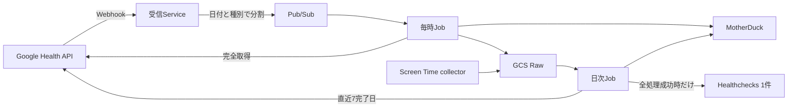

# Webhookを維持する最小構成と西部リージョンへの移行設計

- 作成日: 2026-10-05
- 更新日: 2026-10-06
- 状態: 最小構成へ改訂。旧設計の実装・資産準備は一部完了しているが、最小構成の実装と本番切替は未完了。
- 実施順序: [実装・移行計画](../plans/2026-10-05-pubsub-gcs-migration-plan.md)
- 実環境の記録: [西部移行記録](../../platform/west-migration-2026-10-05.md)

## 目的と構成

Screen TimeとFitbitを継続収集し、GCSへRaw、MotherDuckへ分析履歴を保存する。Webhookを維持し、通知処理の独自台帳・自動復旧機構と常設の運用Jobを減らす。優先順位は金銭的なコスト、保守の手間、source追加の容易さとする。無料枠への収まりは実測で確認する。

定常運用は受信Service 1つ、Pub/Sub topic/subscription各1つ、処理Job 2つ、Scheduler 2つとする。処理Jobは同じimageとruntime Service Accountを使う。

| 用途 | 構成・頻度 |
| --- | --- |
| Webhook受信 | Cloud Run Service。検証と処理単位の発行だけを行う |
| 通知の保持・再配信 | Pub/Sub pull subscription。未ack保持7日 |
| Fitbit取得 | Cloud Run Job。毎時15分、最大50分 |
| Screen Time取り込み・Fitbit再照合・dbt・監査 | Cloud Run Job。日次04:10 Asia/Tokyo、最大100分 |
| 保存・分析 | GCS Standard `us-west1`とMotherDuck `us-west-2` |
| 欠損監視 | Healthchecksの1チェック。日次全体の成功から48時間 |
| 失敗・滞留の通知 | Cloud MonitoringのJob失敗とPub/Sub滞留 |

日次を04:10とするのは、03:15開始の毎時処理が最大50分で終わる想定に5分の余裕を置くためである。実際の起動遅延や手動実行との競合は共通leaseで防ぐ。

常設のpreflight Job、dbt専用Job、source別の外部heartbeat、独自MCP server、通知のexactly-once処理、自動backfillカーソル、汎用Job orchestrationは追加しない。preflight・期間指定取得・復元は必要時に手動で行う。実装済みのAPI client、型付きwriter、共通Loader、Source adapter、Screen Time collectorを利用する。

## Webhookと処理単位

Authorization、Tink署名、対象ユーザー・5種別、1 MiBのbody上限、検証ハンドシェイクを維持する。認証不正は401、不正payloadは400、発行失敗・結果不明は503。受信ServiceにOAuth、MotherDuck、Raw bucketの権限を与えない。

検証した通知を、ユーザー・日付・データ種別ごとの処理単位へ分割し、各単位を1メッセージとして発行する。既存の通知envelopeを使い、`windows`は1要素、期間は1日以内とする。物理時刻はAsia/Tokyoの日境界、睡眠・日次安静時心拍は提供元のcivil dateを使う。時差のない通知に対する既存の保守的な範囲解釈を維持し、保守的な展開で生じた完全な未来日は発行対象から外す。未来だけを明示した物理通知は400で拒否する。現在日の心拍は処理時点で完了した分まで取得し、未来の分を取得済みとして記録しない。同日の後続更新は新通知と日次再照合で取得する。

全処理単位の発行完了後に204を返す。途中発行後に失敗した場合の再送は重複を許容する。1リクエストの展開上限は1,000単位とし、上限超過は発行前に400で拒否し、期間指定の補修対象としてログに残す。Pub/Subへ健康データ本体や資格情報は入れない。

Pub/Subの保存先は`us-west1`、`enforceInTransit=true`、endpointは`pubsub.us-west1.rep.googleapis.com`。subscriptionの自動期限切れを無効にし、ack済み保持・topic追加保持・snapshot・別のdead-letter queueは使わない。

## 毎時取得と失敗時の動作

1回で最大500メッセージ、収集待ちは最大120秒、処理期限は50分とする。空pullはDBへ接続せず終了する。共通の`loader` leaseを取得し、同じ日付・種別を実行中のメモリ内でまとめる。

空ではないpullでは、保存済みの未取り込みFitbit Rawを先に共有Loaderで一度再試行する。未反映Rawが残る範囲を、変更なしとしてackしない。Raw保存後の停止を通知台帳なしで回復するため、GCSのobjectと共通取込metadataを使う。

各処理単位を全ページ取得し、直前の同一範囲・取得条件の成功結果と比較する。未知のAPI項目を含む内容hashを使い、取得時刻やページ分割は比較から外す。変更がなければRawを増やさず、既存のcoverage・対象IDの更新/削除保護に今回の取得時刻をtransactionで反映してからackする。Raw参照は最後に保存したobjectを維持する。過去の成功記録だけで新通知をackしない。

変更した完全取得結果はRawへ保存し、共有Loaderのtransactionで分析データ・coverage・取込結果を確定する。確定できた処理単位だけackし、失敗・未処理の単位は再配信する。複数単位を同じRawに含めた場合は、そのRawのtransactionが確定してから対応する単位をackする。保持中のack期限は延長し、単発の延長は600秒以内とする。

| 失敗箇所 | 再実行 |
| --- | --- |
| API途中ページ・429・通信失敗 | ackせず、既存データを維持して単位を再取得 |
| Raw保存前の停止 | Pub/Subの単位を再取得 |
| Raw保存後のDB反映失敗 | 未取り込みRawを共有Loaderで再試行 |
| DB commitの結果不明 | ackせず再実行。Rawと取込結果を照合し、冪等に反映 |
| DB確定後のack失敗 | 再配信時に再取得しても、同じデータは重複生成しない |
| lease競合・処理期限での保留 | 未処理単位を次回へ返し、保留だけならJob失敗として通知しない |

通知と取得attemptの永続的な対応表、Raw保存前のintent、bundle/chunkの進捗、端末同期checkpointを持たない。新たな中間状態を復旧する代わりに、小さい単位の再取得と保存済みRawの再取り込みを使う。その代償として、途中失敗・ack消失ではAPIを余分に呼ぶことを許容する。

完全取得の空結果は対象範囲の削除として反映する。途中失敗を空結果として扱わない。後から古いRawを再生しても、新しい更新・削除を巻き戻さない。既存のcoverageと削除記録による保護を維持する。

## Rawと必要なDB状態

Screen TimeのSEGB envelope・key・parser・長期履歴は変更しない。新規Rawは90日保持、soft-delete/versioningなし、create-only、hashとgeneration指定readを維持する。移行コピーでは元の保持起点をCustom-Timeへ設定する。

Fitbitの最小Rawは`raw/fitbit/v3/`のgzip JSONとする。完全取得の配列を直接保存し、attempt ID、chunk連結、base64 wrapperを含めない。APIの取得条件・取得日時・全レスポンスの内容を保存する。変更単位を可能な範囲でまとめ、圧縮16 MiBを超える場合は完全取得単位の境界で別objectにする。単一取得が上限を超える場合は、その単位を完了にせず、狭い範囲を指定する手動取得へ回す。

Rawの保存直後は手元の同じbytesをLoaderへ渡す。日次は未取り込みRawを走査し、通常の処理に新たなreceipt/sidecar書き込みを加えない。通知後からAPI取得までの中間更新や、APIで消えた旧状態の完全な再現は保証しない。

Fitbitの永続状態は既存の以下に限定する。

- `ops.fitbit_coverage`・`ops.fitbit_minute_coverage`: 完全取得範囲、取得日時、内容hash、Raw参照
- `ops.fitbit_deleted_record`: 古い取得結果による削除済みIDの復活を防ぐ
- 共通`ops.ingestion_metadata`・Job/lease/監査/成功時刻の記録: 再取り込みと運用確認

`fitbit_scope`、`fitbit_notification`、`fitbit_notification_scope`、`fitbit_attempt`、`fitbit_scope_success`、`fitbit_bundle`、`fitbit_bundle_attempt`、`fitbit_bundle_chunk`、`fitbit_repair_cursor`、`fitbit_device_sync`の10表を通常経路から外す。

西部DBには既にmigration 001〜004を適用している。適用済みSQLとchecksumを変更せず、`src/personal_data_platform/migrations/west/005_minimal_fitbit_processing.sql`で上記10表を撤去する。撤去前に対象10表が空であること、writerがないことを確認する。既存のScreen Time・共通表・型付きFitbit表・coverageは維持する。旧DBへ新migrationを適用しない。

## 日次・手動取得・分析

日次は両Screen Time streamの未取り込みRaw、保存済みFitbit Rawの再試行、5種別の直近7完了日のAPI再照合、dbt、両streamの監査を順に行う。現在日の未完了範囲は毎時取得が扱う。全処理完了時だけ外部heartbeatを1回送る。streamごとの監査結果は共通DBとログに残す。

永続カーソルと端末同期時刻に基づく自動長期backfillは廃止する。7日より長い停止・1,000単位を超えた通知・古い履歴の修復は`pdp fitbit sync --from START --to END`を手動実行する。最後の完了対象日と、7日再照合だけでは埋まらない空白期間は共通Job記録のdetailsへ残す。直近7日の再開だけで過去の空白が埋まったとは記録しない。`--resume-id`は提供しない。期間指定でも日付×種別で順に処理し、同じ範囲の再実行で重複を作らない。期限に達した場合は最初の未完了日と種別を結果へ出し、次の手動実行はそこから指定する。日時指定の手動取得は指定した短い範囲を保ち、日全体へ拡大しない。

心拍は既存の60秒rollUpを使い、平均・最小・最大・観測分数を維持する。元サンプル数はNULL、欠測は0で埋めない。秒心拍を新環境へコピーしない。その他の4種別と睡眠詳細の分析契約を維持する。

Screen Time collectorは30分scan、完成済みsegmentの差分保存、24時間control公開、48時間鮮度監査を維持する。削除・後着・端末休止の意味を変えず、既存の共通処理を作り直さない。

全writerは共通`loader` leaseを使い、125分のlease内で完了する。毎時50分、日次100分、手動最大50分とし、所有権喪失後の書き込みを防ぐ。大きい実行のためのlease更新や追加orchestratorは作らない。

## 監視・資格情報・費用

Healthchecksは1チェック、Period 24時間＋Grace 24時間で、日次処理が実際に全完了した時だけ成功を送る。`PDP_HEARTBEAT_CONFIG`は`daily`のHTTPS URLだけを持つ。原因は既存のJob・監査記録とログから確認する。

Cloud Monitoringは、2 Jobの失敗をまとめた1 policy、Pub/Subの最古未ackが24時間を超える1 policy、受信ServiceのERROR logの1 policyを使う。正常な短い保留に通知しない。Jobごとの重複ERROR metric/policy、日次成功の独自log metric、source別の外部チェックを追加しない。

Secret Managerは本番MotherDuck、Fitbit OAuth JSON、Webhook検証JSON、日次heartbeat JSONの4 payloadを通常runtimeに使い、数値versionへ固定する。receiverと処理Jobの権限を分ける。preflightの独立DB/tokenは手動試験用に保管し、常設Jobへ注入しない。分析/MCPは本番DBのrestricted read-only shareを同じ所有者の分析アカウントへ許可して使い、preflightへ本番shareを渡さない。秘密値はGit・Terraform stateへ入れない。

既作成の西部bucket、Pub/Sub、registry/state、受信Service、空のMotherDuck DBは利用する。未作成のpreflight/dbt Jobは作らない。不要になる資産・secret versionは、本番切替と復元確認後に使用元を確認して整理する。旧Screen Timeと旧組織は一括削除しない。

GCPからAWSへの通信を無料と仮定しない。Cloud Runの北米内インターネット転送無料枠は月1 GiBである。運用再開後にGCS操作数/bytes、Cloud Run実行時間/外向きbytes、MotherDuck容量/CUhを確認する。費用確認のための専用Jobや収集基盤は作らず、既存の監視値と請求情報を使う。[Cloud Run料金](https://cloud.google.com/run/pricing)

## 移行と完了条件

Screen TimeのRaw・分析履歴・必要な共有台帳は、既存のallowlist付きscriptで移す。旧Fitbitは引き継がず、限定期間を新規取得する。旧writerとcollectorを止めて最終差分を確保し、source exportとtarget importは別processで実行する。同じDuckDB processに異なるMotherDuck資格情報を持たせない。

新writerは、Raw/DBの照合、限定5種別の実取得、両streamの監査、日次1 heartbeat、保存済みRawからの復元を確認して有効化する。旧URLへの再送も西部Pub/Subへ発行するよう、切替期間だけ旧receiverを残す。新旧writerを同時に動かさない。

rollbackは最小Raw v3と分心拍を扱えるreleaseを使う。writerを止め、健全な西部warehouseを維持するか、別の空DBへScreen Time backupを復元してFitbitを再取得する。旧DBの台帳を書き換えて戻す方法は使わない。

完了は、新経路の通知→取得→Raw→DB→ack、日次の全処理と欠損監視、collector/分析/MCPの接続先、復元と旧資産の範囲限定整理を確認した時点とする。初回切替の確認と、後日の継続運用・費用計測は別の結果として記録する。
